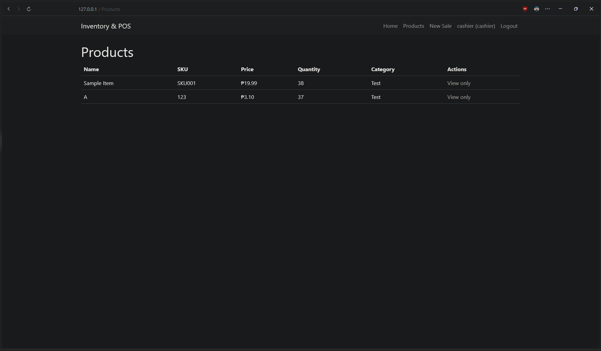
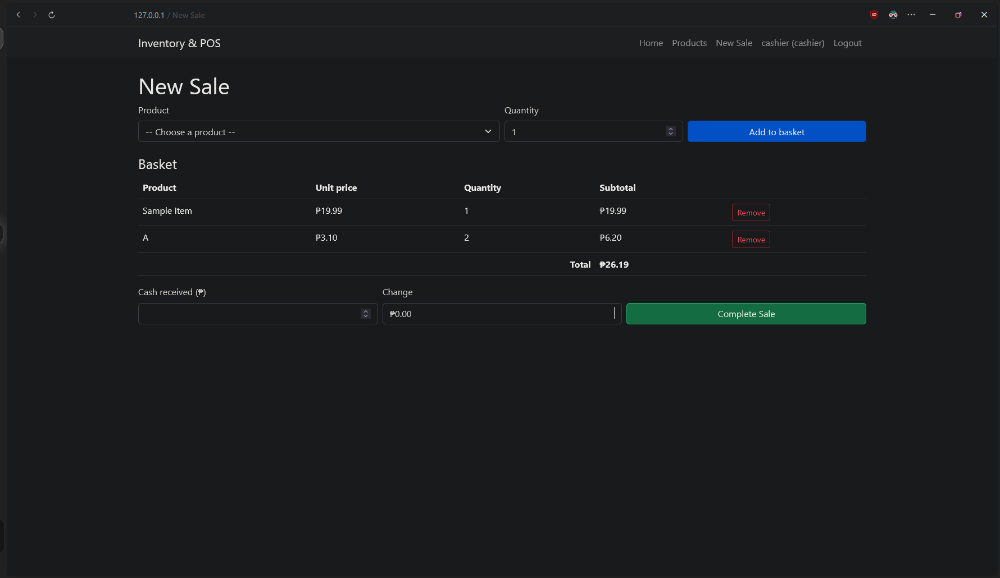
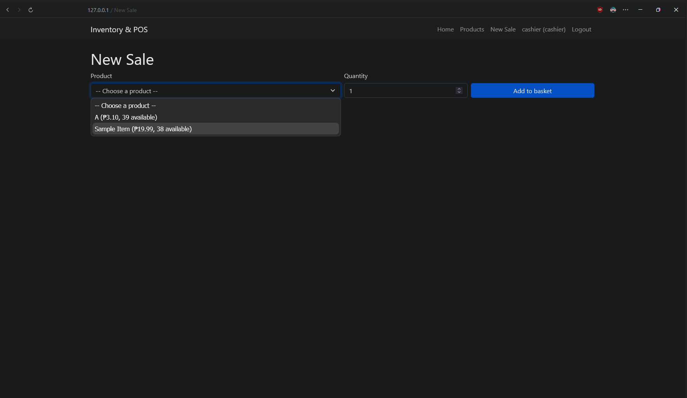
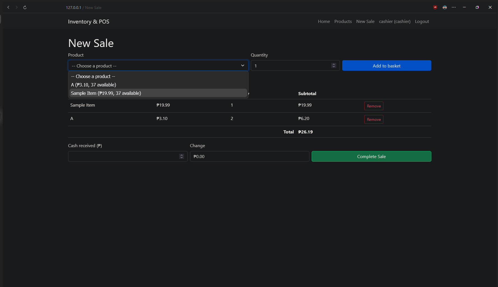
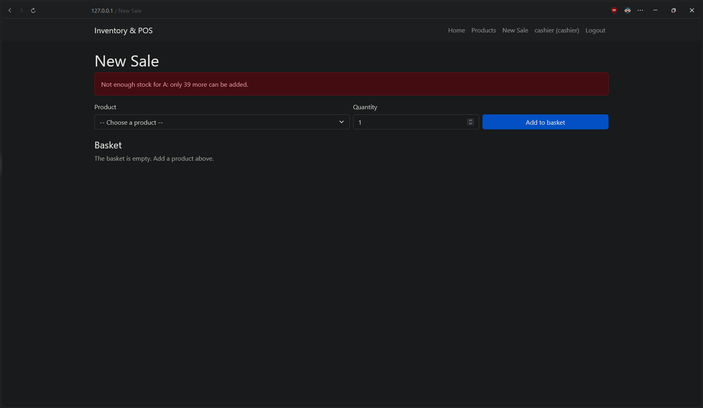
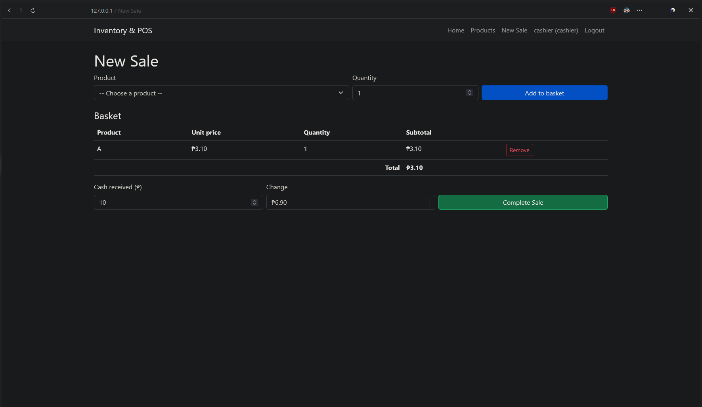
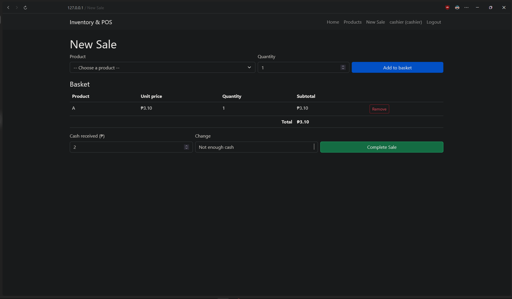
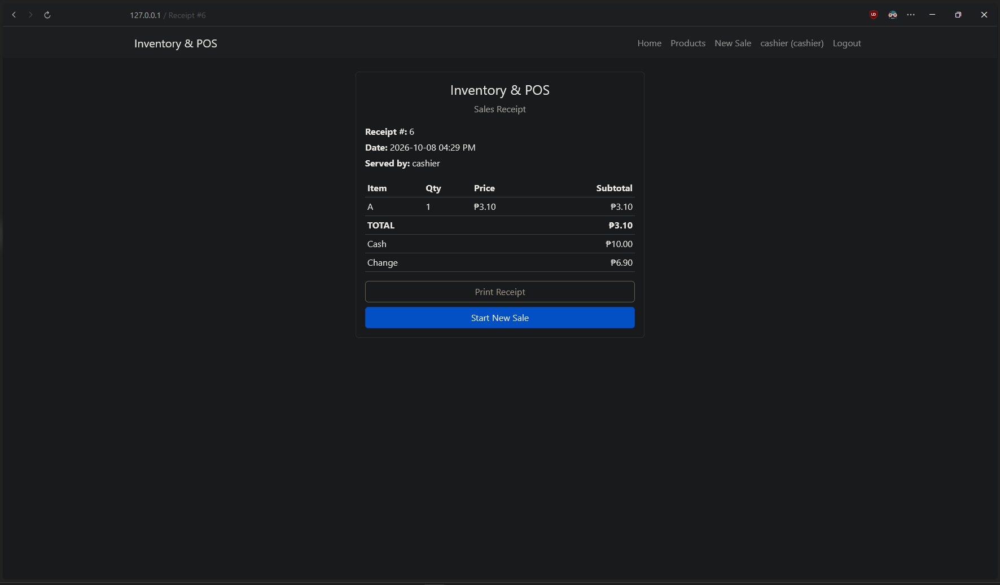
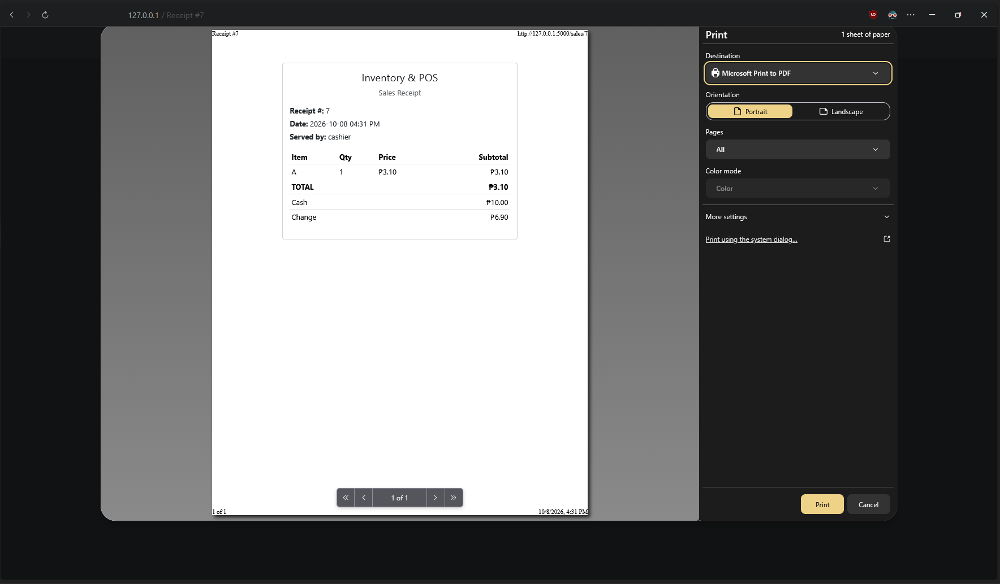

# Inventory & POS System — Project Documentation Draft

> **Living document.** Add to it after every iteration (version tag). Don't wait until the end.
> This draft covers the system up to **v0.18.1** (2026-10-09). Versions v0.8.2–v0.18.1 were implemented and tested by Claude on request
> (time constraint: finals), following the same branch → pull request → merge → tag workflow and the stabilization rule.
> Rebuilt on 2026-10-03 from the Git history and the source code, and tested against v0.7.0.
>
> This is a *draft*, not the final report. The final report will be written in LibreOffice Writer and must
> follow the professor's list in *Final_Project_Details.docx*, Section B. Section 10 below tracks which of
> those items are covered here and which are still to do.

---

## Contents

1. Project overview
2. Software process model (Lecture 2)
3. Version history
4. Actors (who uses the system)
5. User stories (Lecture 3, p. 21 style)
6. Test cases (Lecture 3, p. 31 style)
7. Defects found during testing
8. Use cases (Lecture 4 p. 65 and Lecture 5 p. 15–17 style)
9. Guide: drawing the use case diagram
10. Report checklist (professor's Section B)

---

## 1. Project overview

| Item | Detail |
|---|---|
| Project name | Inventory & POS (Point-of-Sale) System |
| Type | Web application |
| Developer | Solo project |
| Business purpose | Help a small store keep track of its products and stock and record sales at the counter. From v0.14.0 the demo shop is a **café** (coffee and pastries), because a café owner is interested in the project. From v0.15.0–v0.17.0 it handles what that café needs: **GCash payments, Hot / Iced and add-ons, and ingredient stock with recipes**. The café's real menu and photos are loaded only on the student's computer (`local_demo/`, not on GitHub) |
| Language / framework | Python 3.11.9, Flask 3.1.3 |
| Database | SQLite, accessed through Flask-SQLAlchemy 3.1.1 |
| Login and security | Flask-Login 0.6.3; passwords hashed with Werkzeug (scrypt); CSRF tokens, login attempt limit, secret key outside the code (v0.13.1–v0.13.5) |
| User interface | HTML templates (Jinja2) styled with Bootstrap 5.3.3 |
| Version control | Git + GitHub — `https://github.com/JmlAsync/inventory-pos-system` |
| Versioning scheme | Semantic versioning (`MAJOR.MINOR.PATCH`), one tag per finished increment |

**Glossary for beginners**

- **POS (Point of Sale):** the place, and the software, where a customer pays for items, like the cashier's counter at a grocery store.
- **SKU (Stock Keeping Unit):** a unique code a store gives each product (for example `BEV-001`), so two products never get mixed up even if their names are similar.
- **CRUD:** the four basic things you can do with stored data: **C**reate, **R**ead, **U**pdate, **D**elete.
- **Hashing:** turning a password into a scrambled string that can't be turned back into the password. When someone logs in, the system hashes what they typed and compares the two hashes. Even if someone steals the database, they don't get the real passwords.
- **Role-based access control (RBAC):** giving each user a *role* (here: `admin` or `cashier`) and deciding what each role is allowed to do.

---

## 2. Software process model (Lecture 2)

> *Professor's item: "Which one will be your project model — waterfall, incremental or reuse-oriented development. Explain in detail and why?"*

### Chosen model: **Incremental development**

**What it means.** In incremental development the system is built and delivered as a series of small working
versions called **increments**. Each increment adds one piece of functionality to the previous one. After each
increment the system can be run, shown and tested, and what was learned feeds into the next increment.
Specification, development and validation are *interleaved* (they overlap) instead of happening once, in strict order.

**How this project follows it.** Every Git tag is one increment, and every increment produced a version that runs:

| Increment | Added | Could be shown working? |
|---|---|---|
| v0.1.0 | Flask app with a home page | Yes: home page loads |
| v0.2.0 | Product data model and database | Yes: database file is created |
| v0.3.0 | Product list page with Bootstrap | Yes: products display in a table |
| v0.4.0 | Add-product form | Yes |
| v0.5.0 | Edit and delete products | Yes: full CRUD |
| v0.6.0 | Log in / log out | Yes |
| v0.7.0 | Admin vs. Cashier permissions | Yes |
| v0.7.1 | Bug fixes found by testing (patch) | Yes: invalid input now rejected with a message |
| v0.8.0 | Sale processing: basket, cash & change, stock deduction, printable receipt | Yes: a full checkout works end to end |
| v0.8.1 | Receipt fix found by hand testing (patch) | Yes: old receipts say "not recorded" |
| v0.8.2–v0.8.6 | Stabilization patches: race-safe stock, number limits, huge ids, deleted products in basket, text lengths | Yes: every fix verified by tests |
| v0.9.0 | Low-stock warning | Yes: badges + reorder box |
| v0.9.1–v0.9.2 | Stabilization patches: readable box, empty category | Yes |
| v0.10.0 | Sales report (admin) | Yes: revenue, top products, date range |
| v0.10.1–v0.10.2 | Stabilization patches: renamed products, keep sold products | Yes |
| v0.11.0 | Demo data seed script | Yes: realistic shop for the presentation |
| v0.11.1–v0.11.2 | Stabilization patches: receipt order, ₱ thousands separators | Yes |
| v0.12.0 | Profile picture: round avatar with initials, upload/change/remove; automatic database upgrade | Yes |
| v0.13.0 | Modern theme: left sidebar, light/dark switch, dashboard home | Yes: same features, new look |
| v0.13.1–v0.13.5 | Security patches: secret key, CSRF, login limit, debug off + headers, change password | Yes: each attack re-run and now blocked |
| v0.14.0 | Product pictures, tap-to-add menu on New Sale, café demo menu | Yes |
| v0.14.1–v0.14.4 | Stabilization patches: long names, menu order + remembered category, phone basket bar, basket Remove button | Yes |
| v0.15.0 | Payment method: Cash or GCash (reference number) | Yes |
| v0.16.0–v0.16.1 | Servings (sizes) and add-ons for drinks (+ edge-case patch) | Yes |
| v0.17.0–v0.17.3 | Ingredients, recipes and ingredient history (+ deleted-product recipe patch, Hot / Iced wording, demo sales fix) | Yes: drinks are limited by milk and beans on hand |
| v0.17.4 | Patch: number boxes without thousands separators | Yes |
| v0.18.0–v0.18.1 | Ingredients page redesign: groups, search, stock bars, Update window, History tab (+ keep-your-place patch) | Yes: easier to find and update an ingredient |
| v1.0.0 → | Presentation release (planned) | — |

**Why incremental, and not the other two?**

| Model | Why it was / wasn't chosen |
|---|---|
| **Waterfall** | Waterfall needs all requirements fixed and signed off *before* coding starts, and nothing works until the end. I started the project as a complete beginner, so I couldn't predict every requirement or how hard each part would be. A mistake found late in waterfall is expensive to fix. **Not chosen.** |
| **Reuse-oriented** | This model builds the system mainly by configuring and combining existing systems or components (for example, adapting an off-the-shelf POS). The professor requires the code to be written by the student ("if you bring a ready code/project, you will get Fail"), so a system built mostly from existing products would not fit. **Not chosen as the main model.** |
| **Incremental** | ✔ Lets a beginner learn step by step. ✔ Always has a working version to show the professor. ✔ Each increment is small enough to test properly. ✔ Fits Git tagging naturally (one tag = one increment). ✔ If time runs out before the deadline, there is still a working system with the most important features. **Chosen.** |

**Honest note on reuse.** The project still *reuses* well-known components: Flask, Flask-Login,
SQLAlchemy and Bootstrap. Almost every modern project does this. Sommerville points out that most
real projects combine models. So the accurate description is: *an incremental process that reuses
standard framework components*. Saying this in the report shows a deeper understanding than claiming a
"pure" model.

**Weaknesses of incremental (worth stating in the report):** the overall structure can degrade as
increments are added (all routes currently live in one `app.py` file), and progress is harder to measure
against a fixed plan. Planned mitigation: refactor (reorganize code without changing what it does) before the UI polish increment.

---

## 3. Version history

Each version is marked with an **annotated tag**: a tag that also stores a message, a date and who made it.
The tag message summarizes what the increment added.

| Tag | Date | Commit | Tag message (what was added) |
|---|---|---|---|
| — | 2026-08-12 | `2cf8b49` | *(no tag)* Initial commit: add README |
| v0.1.0 | 2026-08-12 | `cb95116` | Walking skeleton: Flask running, GitHub connected |
| v0.2.0 | 2026-08-12 | `d3ca52b` | Walking skeleton plus working database layer (Product model) |
| v0.3.0 | 2026-08-12 | `e6ceedb` | Product list view with Bootstrap-styled templates |
| v0.4.0 | 2026-08-12 | `e2f3947` | Add product creation via form |
| v0.5.0 | 2026-08-12 | `51f0ecc` | Full product CRUD: create, read, update, delete |
| v0.6.0 | 2026-08-12 | `2d1a6ae` | User authentication (login/logout, no role restrictions yet) |
| v0.7.0 | 2026-08-13 | `6f552f9` | Role-based access: Admin can manage products, Cashier is view-only |
| — | 2026-10-03 | `e76f4a1` | *(no tag)* Add documentation draft, test results and use case diagram |
| v0.7.1 | 2026-10-04 | `6043cdb` | Product validation fixes: duplicate SKU, negative values, peso sign *(first feature branch + pull request #1)* |
| — | 2026-10-04 | `1d1dd0e` | *(no tag)* Update documentation for v0.7.1: test results and fixed defects |
| v0.8.0 | 2026-10-08 | `1343236` | Sale processing: basket checkout, cash and change, stock deduction, printable receipt *(pull request #2)* |
| v0.8.1 | 2026-10-08 | `538ce09` | Receipt fix: show 'not recorded' for sales made before cash tracking *(pull request #3)* |
| — | 2026-10-08 | `bf7dc7d` | *(no tag)* Add v0.8.0 hand-test screenshots to documentation |
| v0.8.2 | 2026-10-09 | `caf360f` | Safe stock: atomic deduction prevents overselling when sales overlap *(pull request #4)* |
| v0.8.3 | 2026-10-09 | `1a15679` | Number limits: reject nan, infinity and unrealistic prices, quantities and cash *(pull request #5)* |
| v0.8.4 | 2026-10-09 | `2f94325` | Not found instead of crash for ids too big for the database *(pull request #6)* |
| v0.8.5 | 2026-10-09 | `9dbb8b0` | Deleted products are taken out of the basket instead of blocking the sale *(pull request #7)* |
| v0.8.6 | 2026-10-09 | `decb8f0` | Text limits: name 100, SKU and category 50 characters *(pull request #8)* |
| v0.9.0 | 2026-10-09 | `d27efd5` | Low-stock warning: badges and reorder alert for 5 units or fewer *(pull request #9)* |
| v0.9.1 | 2026-10-09 | `403bd7b` | Low-stock box: 5 most urgent shown, count of the rest *(pull request #10)* |
| v0.9.2 | 2026-10-09 | `a7b4c9c` | Empty category shows a dash instead of 'None' *(pull request #11)* |
| v0.10.0 | 2026-10-09 | `aa07bb2` | Sales report: revenue, sales count, items sold and top products by date range *(pull request #12)* |
| v0.10.1 | 2026-10-09 | `96b6682` | Top products: a renamed product counts once *(pull request #13)* |
| v0.10.2 | 2026-10-09 | `d095cd9` | Products with sales history can't be deleted *(pull request #14)* |
| v0.11.0 | 2026-10-09 | `9c0bbac` | Demo data: seed script with shop products and a week of sales *(pull request #15)* |
| v0.11.1 | 2026-10-09 | `e02353c` | Demo data: receipt numbers follow the clock *(pull request #16)* |
| v0.11.2 | 2026-10-09 | `16c6c7a` | Money shown with thousands separators (₱6,904.50) *(pull request #17)* |
| — | 2026-10-09 | — | Documentation update for v0.8.2–v0.11.2 *(pull request #18, no tag)* |
| v0.12.0 | 2026-10-09 | `5f3648e` | Profile pictures: round avatar (initials until a picture is uploaded), avatar menu, automatic database upgrade *(pull request #19)* |
| v0.13.0 | 2026-10-09 | `ea368ff` | Modern theme: left sidebar with icons, light "Clean counter" / dark "Night shift" switch, dashboard home, card layout *(pull request #20)* |
| — | 2026-10-09 | — | Documentation update for v0.12.0–v0.13.0 *(pull request #21, no tag)* |
| v0.13.1 | 2026-10-09 | `b9e44a8` | Secret key out of the code (environment variable or `instance/secret_key.txt`) *(pull request #22)* |
| v0.13.2 | 2026-10-09 | `9da53af` | CSRF tokens on every form; logout is a button; SameSite cookie *(pull request #23)* |
| v0.13.3 | 2026-10-09 | `9134e6a` | Login attempt limit: 5 wrong passwords → wait 5 minutes *(pull request #24)* |
| v0.13.4 | 2026-10-09 | `aed2017` | Debug mode off by default; browser security headers *(pull request #25)* |
| v0.13.5 | 2026-10-09 | `7893486` | Change password on the profile page *(pull request #26)* |
| v0.14.0 | 2026-10-09 | `59c6d54` | Product pictures with icon tiles, tap-to-add menu on New Sale, café demo menu (`--fresh`) *(pull request #27)* |
| v0.14.1 | 2026-10-09 | `2795482` | Very long names wrap on the menu and in tables *(pull request #28)* |
| v0.14.2 | 2026-10-09 | `afea681` | Menu in category order; chosen category kept after each tap *(pull request #29)* |
| v0.14.3 | 2026-10-09 | `e598e88` | Phone basket bar; table columns stay readable *(pull request #30)* |
| — | 2026-10-09 | — | Documentation update for v0.13.1–v0.14.3 *(pull request #31, no tag)* |
| v0.14.4 | 2026-10-09 | `8a34326` | Basket Remove button always visible; menu and basket side by side from 1200 px *(pull request #32)* |
| v0.15.0 | 2026-10-09 | `aa44988` | Cash or GCash payment with a 13-digit reference; receipt and report show the method *(pull request #33)* |
| v0.16.0 | 2026-10-09 | `40555c0` | Sizes and add-ons: admin page, drink window on New Sale, options on receipts *(pull request #34)* |
| v0.16.1 | 2026-10-09 | `2f97c8d` | Sizes/add-ons edge cases: unticked product, very long add-on list *(pull request #35)* |
| v0.17.0 | 2026-10-09 | `4492d92` | Ingredients, recipes, can-make counts, ingredient history; sales use ingredients up *(pull request #36)* |
| v0.17.1 | 2026-10-09 | `63f9d53` | A deleted product's recipe is deleted too (no inherited recipes) *(pull request #37)* |
| v0.17.2 | 2026-10-09 | `da4a932` | The one-of choice is called a *serving*, so the café's Hot / Iced reads naturally (sizes still possible) *(pull request #38)* |
| v0.17.3 | 2026-10-09 | `a7cd2e5` | Demo sales include products whose stock comes from ingredients (no more ₱0 demo receipts) *(pull request #39)* |
| — | 2026-10-09 | — | Documentation update for v0.14.4–v0.17.3 *(pull request #40, no tag)* |
| v0.17.4 | 2026-10-09 | `c985356` | Number boxes show `2000`, not `2,000` (which they can't read) *(pull request #41)* |
| v0.18.0 | 2026-10-09 | `9689751` | Ingredients page: groups, Full level and stock bars, search and filters, Needs attention, Update window, ingredient page, History tab *(pull request #42)* |
| v0.18.1 | 2026-10-09 | `11e33e7` | Ingredients page keeps the search, filter and row after an update *(pull request #43)* |

*From v0.8.2 the Commit column shows the commit with the change; the tag sits on the GitHub merge commit of that pull request.
Pull request numbers assume the versions were published in order in one session.*

**How the version numbers work (semantic versioning):** `MAJOR.MINOR.PATCH`.
- **MINOR** goes up when a new feature is added (v0.6.0 → v0.7.0).
- **PATCH** goes up for bug fixes only (v0.7.0 → v0.7.1). The defects in Section 7 would be a good v0.7.1.
- **MAJOR** goes from 0 to 1 when the system is complete and ready to hand in (v1.0.0). The professor's
  document uses 1.0.0, 1.0.1, 1.0.2 as examples, so the final submission should be tagged **v1.0.0**.

---

## 4. Actors (who uses the system)

An **actor** is anyone (or anything) outside the system that interacts with it.

| Actor | Description | Can currently do |
|---|---|---|
| **Visitor** | Anyone who opens the website but has not logged in | See the home page; go to the login page |
| **User** *(general)* | Any logged-in person. This is a "parent" actor: Admin and Cashier are both kinds of User | Log in, log out, view the product list |
| **Admin** | Store owner or manager. *Is a* User | Everything a User can do, **plus** add, edit and delete products and view the sales report |
| **Cashier** | Counter staff. *Is a* User | Everything a User can do: view products, process sales, change their picture (cannot change products or see the sales report) |

> **Why "User" as a parent?** Admin and Cashier share some abilities (log in, log out, view products).
> Instead of drawing the same lines twice, UML lets you draw them once on a general *User* actor and
> show that Admin and Cashier *inherit* them. This is called **generalization**. It matches the code: there is one
> `User` table, and a `role` column decides admin vs. cashier.

---

## 5. User stories (Lecture 3, p. 21 style)

> Sommerville's example ("A 'prescribing medication' story") is a short **narrative**: it follows a named
> person through a realistic situation and describes what they do and what the system does, in plain language.
> Characters used below: **Maria** (store owner, Admin) and **Jun** (cashier).

### Story F1 — Viewing the product list *(v0.3.0)*
Jun arrives for his morning shift at the store. A customer asks whether there is any 1.5-litre Coke left.
Jun logs in to the Inventory & POS system on the counter computer and opens the **Products** page. The
system shows a table of every product with its name, SKU, price, quantity in stock and category. Jun finds
"Coke 1.5L" in the table, sees that 24 are in stock, and tells the customer where to find it.

### Story F2 — Adding a new product *(v0.4.0)*
A supplier delivers a new brand of instant noodles. Maria logs in as Admin and opens the Products page,
where she sees an **Add Product** button (cashiers don't see it). She clicks it and a form appears asking for
the name, SKU, price, quantity and an optional category. She enters "Instant Noodles", SKU `FD-001`, price
15.00, quantity 10 and category "Food", then clicks **Add Product**. The system saves the product in the
database and takes her back to the product list, where the noodles now appear.

### Story F3 — Editing a product *(v0.5.0)*
The supplier raises the price of Coke 1.5L. Maria finds Coke in the product list and clicks its **Edit**
button. The system opens a form already filled in with the current details. She changes the price from 75.50
to 80.00 and the quantity to 20 after a stock count, then clicks **Save Changes**. The system updates the
record and returns her to the list showing the new values. If she had changed her mind, **Cancel** would
take her back without saving.

### Story F4 — Deleting a product *(v0.5.0)*
The store stops selling a product that no longer sells. Maria clicks **Delete** next to it. The browser asks
"Delete this product?" to protect against accidental clicks. She confirms, the system removes the product from
the database, and it disappears from the list.

### Story F5 — Logging in and out *(v0.6.0)*
Jun opens the system and clicks **Login**. He types his username and password. The first time, he mistypes
the password, so the system shows "Invalid username or password" without saying which of the two was wrong
(so a stranger can't learn which usernames exist). He tries again correctly and is taken to the product list.
The navigation bar now shows "cashier (cashier)" so he can see who is logged in. At the end of his shift he
clicks **Logout** and is returned to the home page. If anyone tries to open the Products page afterwards
without logging in, the system sends them to the login page.

### Story F6 — Admin and Cashier permissions *(v0.7.0)*
Maria wants cashiers to be able to look up products but not change prices or delete items. When Jun logs in
as a cashier, the product list shows "View only" where the Edit and Delete buttons would be, and there is no
Add Product button. Curious, Jun types the address of the add-product page (`/products/add`) directly into
the browser. The system refuses and shows a "403 – Access Denied" page with a button back to the products. The
check happens on the server, so hiding the buttons is not the only protection. When Maria logs in as admin,
all buttons are available to her.

### Story F7 — Processing a sale *(v0.8.0, fixed in v0.8.1)*
A customer at the counter brings two Cokes and three packs of noodles. Jun (or Maria, since the owner often covers the
counter) clicks **New Sale** in the navigation bar. He picks "Coke 1.5L" from a dropdown that shows each product's price
and how many are **available**, types 2, and clicks **Add to basket**; then does the same for the noodles. The basket shows
each line's subtotal and the total, ₱271.50, and the dropdown now shows fewer Cokes and noodles **available**, because
the ones in the basket are spoken for. (Adding a product that's already in the basket makes its line grow instead of
appearing twice; a wrong line can be taken out with **Remove**.) The customer hands over ₱500; as Jun types it into **Cash received**,
the page already shows the change, ₱228.50. He clicks **Complete Sale**. The system checks once more that every item
is still in stock, saves the sale, lowers the stock of each product, empties the basket and shows a **receipt** with the
receipt number, date and time, "Served by: cashier", every item, the total, the cash and the change. Jun clicks
**Print Receipt**; only the receipt is printed, without the menu or buttons. Had he typed ₱200, or tried to sell more
noodles than the shop has, the system would have refused with a clear message and saved nothing. Receipts from before
cash was recorded state "Cash and change not recorded" instead of showing a misleading ₱0.00 *(v0.8.1)*.

### Story F8 — Low-stock warning *(v0.9.0, fixed in v0.9.1–v0.9.2)*
When Maria opens **Products** in the morning, a yellow box at the top says *"Low stock (4): Shampoo Sachet (0 left),
Ensaymada (3 left), Sardines 155g (4 left), Tomatoes 1kg (5 left)"*. In the table, Shampoo Sachet has a red
**Out of stock** badge and the others a yellow **Low** badge. Jun sees the same box when he logs in as cashier, so he
can tell Maria before customers ask. After the delivery, Maria edits Tomatoes to 25; its badge and its place in the
box disappear. On a busy week with dozens of low products, the box shows only the five most urgent and says
"and 30 more", so the product table stays visible *(v0.9.1)*. Products without a category show a dash *(v0.9.2)*.

### Story F9 — Sales report *(v0.10.0, fixed in v0.10.1–v0.10.2)*
At closing time Maria clicks **Sales Report** (cashiers don't see this link). Today's report shows three cards:
revenue **₱1,215.00**, **9** sales and **23** items sold, then the top 5 products by units sold and every sale with
a link to its receipt. To compare the week, she picks From = last Friday and To = today and clicks **Show**.
She renamed "Cola" to "Cola 1.5L" on Wednesday; the report still counts it as one product *(v0.10.1)*. When she
tries to delete a product that has been sold, the system refuses and suggests setting its quantity to 0, so old
reports and receipts stay correct *(v0.10.2)*.

### Story F10 — Profile picture *(v0.12.0)*
Juan, a cashier, logs in for the first time. At the bottom of the sidebar he sees a green circle with his initials,
**JU**, next to his name and role. He clicks it; a small menu says *Signed in as Cashier* and offers **Change picture**
and **Log out**. He chooses Change picture, picks a JPG photo from his phone gallery (under 2 MB) and clicks
**Upload picture**. The circle now shows his photo, cropped to a circle, on every page. A week later he uploads a
new photo; the old file is deleted from the server. When he tries a GIF, the system says it only accepts PNG,
JPG or WebP. When he uploads a 5 MB photo, it says *"That picture is too big. The limit is 2 MB."* and nothing
breaks. Clicking **Remove picture** brings back his initials.

### Story F11 — Modern theme with light and dark mode *(v0.13.0)*
Maria opens the system in the morning. A sidebar on the left lists **Home, Products, New Sale** and, because she
is the admin, **Sales Report**; the page she is on is highlighted. Home shows today's numbers (products, low
stock, sales today, revenue today) and shortcut tiles. In the evening the store lights are dim, so she clicks
**Dark mode** at the bottom of the sidebar: the system turns charcoal with amber highlights. Tomorrow it opens in
dark mode again because her browser remembers the choice. When she prints a receipt from dark mode, the
printout is still black on white. On her phone, the sidebar hides behind a ☰ menu button at the top.

### Story F12 — Account safety *(v0.13.1–v0.13.5)*
On her first day with the system, Maria opens her avatar menu, chooses **Change password**, types the default
`admin123` once and her new password twice. A password shorter than 8 characters, or the same as her username, is
refused with a message. Later, someone at the counter tries to guess her password: after 5 wrong tries the page says
*"Too many failed attempts. Please wait 5 minutes and try again."*, even if the sixth guess is right. Behind the
scenes, every form carries a hidden security token, so a stranger's website can't make her browser add a product or
log her out, and the key that protects her login cookie is no longer published on GitHub.

### Story F13 — Product pictures and the café menu *(v0.14.0–v0.14.3)*
Ana runs a small café. When she adds "Iced Ube Latte (16oz)" she attaches a photo; products without one show a
coloured icon (a hot cup for hot coffee, an iced cup for iced drinks, a pastry for pastries, a cake for cakes).
At the counter, Juan opens **New Sale** and sees the menu as picture tiles grouped by category. He taps
**Pastries**, then taps **Butter Croissant** twice; each tap adds one, and the Pastries filter stays selected
*(v0.14.2)*. Each tile shows what is left ("3 left" in amber when low). The basket sits beside the menu on the
laptop; on his phone a bar at the bottom shows *"2 items · ₱190.00 — Pay"* and jumps to the basket *(v0.14.3)*.
For an exact quantity he can still use the product list and the Quantity box below the menu.

### Story F14 — Paying by GCash *(v0.15.0)*
A customer orders a Sea Salt and a croffle (₱340.00) and wants to pay by GCash. Juan taps **GCash** in the payment box:
the cash fields disappear and a box asks for the **reference number**. The customer pays in the GCash app and shows the
receipt; Juan types its 13-digit reference (`1023 456 789012`) and checks that the amount is ₱340.00, then clicks
**Complete Sale**. The receipt says *Paid by GCash* with the reference and no change. If he types a reference that was
already used, the system names the earlier receipt. At closing, the Sales Report shows revenue split into cash (what
should be in the drawer) and GCash.

### Story F15 — Hot / Iced and add-ons *(v0.16.0–v0.16.1, wording v0.17.2)*
Maria sets up the servings (**Hot** and **Iced**, same price; v0.16.0 called them sizes, and a shop can still use
12oz / 16oz +₱20) and the café's upgrades (Espresso +₱30, Sub Oat +₱40, Cold Foam +₱30…) on the **Servings & Add-ons**
page, and ticks "Drink" on each latte. The Iced serving has its own recipe: 150 g of ice and an iced cup. When Juan
taps **Sea Salt**, a small window opens: he picks **Iced** and **Sub Oat**, and the button shows *Add 1 · ₱220.00*.
The basket shows the line as *Sea Salt — Iced, Sub Oat*, separate from a Hot Sea Salt, and the receipt keeps the
options and the price paid, even if the add-on price changes later.

### Story F16 — Ingredients and recipes *(v0.17.0–v0.17.1)*
Maria enters what is in the stock room on the **Ingredients** page (espresso beans 3,000 g, fresh milk 10,000 ml, oat milk
2,000 ml, croissant dough 24 pcs…) and a **recipe** for each product: one Sea Salt uses 18 g of beans, 160 ml of milk and
40 ml of cream; Sub Oat replaces the fresh milk with oat milk; a 16oz uses 1.33 times as much. The menu now shows how
many of each drink can still be made. When the oat milk runs low, Home warns her; when a delivery arrives she clicks
**Restock** (+2,000 ml), and after counting the shelf at night she uses **Count**. Every change (each sale, delivery
and count) appears in the ingredient history with who did it and which receipt it belongs to.

### Story F17 — Finding and updating an ingredient quickly *(v0.18.0–v0.18.1)*
On Saturday morning the milk delivery arrives. Maria opens **Ingredients**: the page starts with a **Needs attention**
card (Lotus biscuits, Low, 5 of 30), then one card per group: Coffee, Milk & cream, Syrups & sauces, Toppings, Bakery,
Cups & packaging. Each row shows a bar of how full the shelf is, with a mark at the warn level. She types "oat" in
the search box, clicks **Update** on Oat milk, and a small window opens on **Restock**; she taps *Fill up to full
(+2,000)* and **Add to stock**. The page comes back to the Oat milk row with her search still there *(v0.18.1)*.
Later she clicks **History** and filters to Cocoa powder to see last night's count.

---

## 6. Test cases (Lecture 3, p. 31 style)

> Sommerville's example ("Test case description for dose checking") gives, for each feature,
> the **Input**, the **Tests** to run, and the expected **Output**. Below, each feature has that summary,
> followed by a detailed table of individual test cases.
>
> **How these were run.** On 2026-10-03, every case was run against an untouched copy of v0.7.0 using
> Flask's built-in *test client* (a tool that sends requests to the app the way a browser would, but
> automatically), with a fresh database. TC-6.1 to TC-6.3, TC-6.6, TC-2.3, TC-2.5 and DEF-05 were **also confirmed
> by hand** in a real browser on the same day.
>
> **Reading the HTTP codes:** `200` = page shown OK · `302` = redirected to another page · `403` = forbidden ·
> `404` = not found · `405` = method not allowed · `500` = the server crashed.

### F1 — View product list

**Input:** a request to open `/products`, with or without being logged in.
**Tests:** 1. Open the page while logged out. 2. Open it while logged in. 3. Check that every saved product appears with all five fields.
**Output:** logged out → redirect to the login page; logged in → table of all products.

| ID | Precondition | Steps / input | Expected result | Actual result | Pass? |
|---|---|---|---|---|---|
| TC-1.1 | Not logged in | Open `/products` | Redirect to `/login` | 302 → `/login?next=/products` | ✅ |
| TC-1.2 | Logged in as admin, product "Coke 1.5L" exists | Open `/products` | Table shows Coke 1.5L, BEV-001, price, quantity, category | All fields shown | ✅ |
| TC-1.3 | Not logged in | Open `/` (home) | Home page loads | 200, home page shown | ✅ |

### F2 — Add product

**Input:** name (text, required), SKU (text, required, must be unique), price (decimal number), quantity (whole number), category (optional text).
**Tests:** 1. All fields valid. 2. Category left empty. 3. SKU already used. 4. Price not a number. 5. Negative price or quantity. 6. Empty name.
**Output:** valid input → product saved and shown in the list; invalid input → a clear error message and nothing saved.

| ID | Precondition | Steps / input | Expected result | Actual result | Pass? |
|---|---|---|---|---|---|
| TC-2.1 | Logged in as admin | Coke 1.5L, BEV-001, 75.50, 24, Beverages | Saved; redirect to list; shown as 75.50 | Saved, redirect, shown | ✅ |
| TC-2.2 | Admin | Noodles, FD-001, 15, 10, *(no category)* | Saved with empty category | Saved | ✅ |
| TC-2.3 | Admin, BEV-001 already exists | Dup, **BEV-001**, 1, 1 | Error message "SKU already exists"; nothing saved | **500 server crash** (database unique-constraint error not handled) *(also confirmed by hand: `IntegrityError`)* · **v0.7.1:** red message, nothing saved *(confirmed by hand)* | ❌→✅ DEF-01 |
| TC-2.4 | Admin | price = `abc` (sent without the browser's check) | Error message; nothing saved | **500 server crash** · **v0.7.1:** error message, nothing saved | ❌→✅ DEF-02 |
| TC-2.5 | Admin | price = **-5**, quantity = **-3** | Rejected: price and quantity cannot be negative | **Accepted and saved** with negative values *(negative price also confirmed by hand)* · **v0.7.1:** rejected by browser (`min="0"`) and by server | ❌→✅ DEF-03 |
| TC-2.6 | Admin | name = *(empty)*, sent without the browser's check | Rejected: name required | **Accepted**; product saved with no name · **v0.7.1:** rejected with message | ❌→✅ DEF-04 |

> **Why "sent without the browser's check"?** The form's HTML has `required` and `type="number"`, so a
> normal browser stops you before sending. But anyone can bypass the browser (with developer tools or a
> script), so the **server** must check again. This is called **server-side validation**, and it is a
> standard security rule: *never trust input from the client*.

### F3 — Edit product

**Input:** a product ID in the address (`/products/edit/<id>`) and the same fields as F2.
**Tests:** 1. Form opens pre-filled. 2. Valid change is saved. 3. Product ID doesn't exist. 4. SKU changed to one another product uses.
**Output:** changes saved and shown; a missing product gives "not found"; a duplicate SKU gives a clear error.

| ID | Precondition | Steps / input | Expected result | Actual result | Pass? |
|---|---|---|---|---|---|
| TC-3.1 | Admin, product 1 exists | Open `/products/edit/1` | Form pre-filled with current values | Pre-filled | ✅ |
| TC-3.2 | Admin | Change price 75.50 → 80, quantity 24 → 20, save | Saved; list shows new values | Saved (80.0, 20) | ✅ |
| TC-3.3 | Admin | Open `/products/edit/999` | 404 Not Found | 404 | ✅ |
| TC-3.4 | Admin, FD-001 belongs to another product | Change product 1's SKU to FD-001 | Error "SKU already exists" | **500 server crash** · **v0.7.1:** error message, nothing changed | ❌→✅ DEF-01 |

### F4 — Delete product

**Input:** a product ID, sent with a POST request (the Delete button).
**Tests:** 1. Delete an existing product. 2. Delete a product that doesn't exist. 3. Try to delete with a plain link visit (GET) instead of the button.
**Output:** product removed; missing ID → 404; GET → refused.

| ID | Precondition | Steps / input | Expected result | Actual result | Pass? |
|---|---|---|---|---|---|
| TC-4.1 | Admin, product 2 exists | Click Delete on product 2, confirm | Removed from database and list | Removed | ✅ |
| TC-4.2 | Admin | POST `/products/delete/999` | 404 | 404 | ✅ |
| TC-4.3 | Admin | Visit `/products/delete/2` as a normal link (GET) | Refused (deleting through a link is unsafe) | 405 Method Not Allowed | ✅ |
| TC-4.4 | Admin | Click Delete, then Cancel in the pop-up | Product kept | Pop-up is in the browser (`confirm()`); confirmed by code reading, **to test by hand** | ⏳ |

> **Why does TC-4.3 matter?** If deleting worked through a simple link, a web crawler or a malicious link in
> an email could delete products just by visiting it. Requiring POST (a form submission) prevents that.

### F5 — Log in / log out

**Input:** username and password.
**Tests:** 1. Correct details. 2. Wrong password. 3. Username that doesn't exist. 4. Username in different capitals. 5. Logout. 6. Protected page after logout. 7. Passwords are not stored in plain text.
**Output:** correct → logged in and sent to Products; wrong → the same general error message; logout → protected pages locked again.

| ID | Precondition | Steps / input | Expected result | Actual result | Pass? |
|---|---|---|---|---|---|
| TC-5.1 | Users exist | admin / admin123 | Redirect to Products; navbar shows "admin (admin)" | As expected | ✅ |
| TC-5.2 | — | admin / *wrong* | "Invalid username or password" | Shown | ✅ |
| TC-5.3 | — | ghost / x | Same message as TC-5.2 (doesn't reveal which part was wrong) | Same message | ✅ |
| TC-5.4 | — | **ADMIN** / admin123 | *Design decision:* usernames are case-sensitive → rejected | Rejected | ✅ |
| TC-5.5 | Logged in | Click Logout | Logged out; redirect to home | 302 → `/` | ✅ |
| TC-5.6 | Just logged out | Open `/products` | Redirect to login | 302 → `/login` | ✅ |
| TC-5.7 | Users created | Look at the `password_hash` column in the database | A hash, not the real password | Stored as `scrypt:32768:8:1$…` hash | ✅ |
| TC-5.8 | Not logged in | Open `/products/add` → log in | After login, return to the page originally requested | Always goes to `/products` (the `next` value is ignored) | ⚠️ minor, DEF-06 |

### F6 — Role-based access (Admin vs. Cashier)

**Input:** a logged-in user with role `admin` or `cashier`, requesting product-management pages.
**Tests:** 1. Cashier sees no management buttons. 2. Cashier types each admin address directly. 3. Cashier sends a hidden form submission. 4. Admin keeps full access.
**Output:** cashier → view only, every admin action refused with 403; admin → full access.

| ID | Precondition | Steps / input | Expected result | Actual result | Pass? |
|---|---|---|---|---|---|
| TC-6.1 | Logged in as cashier | Open `/products` | No Add button; "View only" instead of Edit/Delete | As expected *(also checked by hand)* | ✅ |
| TC-6.2 | Cashier | Type `/products/add` in the address bar | 403 Access Denied page | 403 page *(also checked by hand)* | ✅ |
| TC-6.3 | Cashier | Open `/products/edit/1` | 403 | 403 | ✅ |
| TC-6.4 | Cashier | Send a POST to `/products/add` with product data | 403; nothing saved | 403 | ✅ |
| TC-6.5 | Cashier | Send a POST to `/products/delete/1` | 403; product still exists | 403; product still exists | ✅ |
| TC-6.6 | Logged in as admin | Add / edit / delete | All allowed | Allowed *(also checked by hand)* | ✅ |

### F7 — Process sale *(v0.8.0, v0.8.1)*

**Input:** products and quantities added to a basket; cash received from the customer.
**Tests:** 1. Building the basket (adding, merging, removing). 2. Stock limits, including what is already in the basket. 3. Invalid quantities and products. 4. Cash checks. 5. Completing a sale and its effect on stock. 6. Receipts, including old ones. 7. Who can sell, and basket privacy.
**Output:** valid sale → saved, stock reduced, receipt shown; anything invalid → clear message and **nothing saved**.

> **How these were run.** On 2026-10-08 against the code tagged **v0.8.0** (`1343236`) using the Flask test client, plus a real
> browser (Chromium) for the JavaScript change preview; v0.8.1 (`538ce09`) was re-tested the same day, including on a
> **copy of the real database**. Cases marked *(by hand)* were also confirmed by Yesha in the running app.

| ID | Precondition | Steps / input | Expected result | Actual result | Pass? |
|---|---|---|---|---|---|
| TC-7.1 | Not logged in | Open `/sales/new` | Redirect to login | 302 → `/login` | ✅ |
| TC-7.2 | Cashier; Coke ₱75.50, Noodles ₱15 | Add Coke × 2, Noodles × 3 | Two lines; total ₱271.50 | As expected *(by hand: Sample Item × 1 + A × 2 = ₱26.19, screenshot S2)* | ✅ |
| TC-7.3 | Coke × 2 in basket | Add Coke × 1 again | One line, × 3 (not two lines) | One line, × 3 | ✅ |
| TC-7.4 | Noodles: 10 in stock | Add 3 → look at dropdown; add the other 7 | "7 available"; then Noodles leaves the dropdown; database stock stays 10 until the sale is completed | As expected *(by hand: A 39 / Sample Item 38 before; 37 / 37 available with A × 2 and Sample Item × 1 in the basket, screenshots S3–S4)* | ✅ (DEF-10) |
| TC-7.5 | Coke: 5 in stock, 3 in basket | Add Coke × 3 | "only 2 more can be added"; basket unchanged | As expected *(by hand: "Not enough stock for A: only 39 more can be added.", screenshot S5)* | ✅ |
| TC-7.6 | Cashier | Quantity 0, −2, `abc` | "Quantity must be a whole number of at least 1." | As expected | ✅ |
| TC-7.7 | Cashier | No product chosen; product ID 999 | "Please choose a product." | As expected | ✅ |
| TC-7.8 | Soap: 0 in stock | Look at dropdown; send a hand-made request for Soap × 1 | Not listed; request refused | Not listed; "only 0 more can be added" | ✅ |
| TC-7.9 | Two lines in basket | **Remove** one | Line gone; total updates | As expected | ✅ |
| TC-7.10 | Empty basket | **Complete Sale** | "The basket is empty." | As expected | ✅ |
| TC-7.11 | Basket total ₱226.50 | Cash ₱200; `abc`; nothing | "Cash received must be a number of at least ₱226.50."; no sale saved | As expected; 0 sales saved | ✅ |
| TC-7.12 | Noodles × 3 in basket; stock then lowered to 2 elsewhere | **Complete Sale** | "…no longer has enough stock"; nothing saved, no stock changed | As expected | ✅ |
| TC-7.13 | Basket Coke × 3 (₱226.50), Coke stock 5 | Cash ₱500 → **Complete Sale** | Receipt: number, date, "Served by", items, total ₱226.50, cash ₱500.00, change ₱273.50; Coke stock 5 → 2; basket emptied | As expected *(by hand: receipt #4 ₱12.40, ₱500 cash → ₱487.60 change; receipt #6 ₱3.10, ₱10 cash → ₱6.90 change; A's stock 39 → 37 after receipts #6 and #7, screenshots S8, S1)* | ✅ |
| TC-7.14 | Basket ₱15.00 | Cash exactly ₱15 | Change ₱0.00 | Change ₱0.00 | ✅ |
| TC-7.15 | Logged in as **admin** | Complete a sale | Allowed; "Served by: admin" | As expected | ✅ |
| TC-7.16 | Receipt for Coke at ₱75.50 exists | Change Coke's price, then delete Coke; reopen receipt | Receipt still shows "Coke 1.5L" at ₱75.50 | As expected *(since v0.10.2 a sold product can no longer be deleted; the receipt keeps the name and price from the time of sale after a rename or price change)* | ✅ |
| TC-7.17 | Items in basket | Logout → log in as another user → New Sale | Basket empty | Empty | ✅ (DEF-09) |
| TC-7.18 | Two browsers logged in | Add items in one | Other browser's basket unaffected | Unaffected | ✅ |
| TC-7.19 | Basket ₱151.00 (browser) | Type cash 100, then 200 | Change box: "Not enough cash", then ₱49.00 | As expected; no script errors *(by hand: ₱3.10 total, cash 2 → "Not enough cash", cash 10 → ₱6.90, screenshots S6–S7)* | ✅ |
| TC-7.20 | Receipt open | **Print Receipt** → print preview | Only the receipt; no navbar or buttons | *(by hand, 2026-10-08)* Print preview of receipt #7 shows only the receipt card: no navigation bar, no Print/New Sale buttons (screenshot S9) | ✅ |
| TC-7.21 | Receipt #1–#3, made before cash was recorded | Open the receipt | No misleading cash amount | **v0.8.0:** "Cash ₱0.00 / Change ₱0.00" · **v0.8.1:** "Cash and change not recorded…"; #4 unchanged *(checked on a copy of the real database)* | ❌→✅ DEF-12 |
| TC-7.22 | Logged in | `/sales/999`; visit `/sales/complete` as a link (GET) | 404; 405 | 404; 405 | ✅ |
| TC-7.23 | Database from before v0.8.0's cash columns | **Complete Sale** | Sale saved | **Crash** "table sale has no column named cash_received" *(by hand)* → fixed by adding the columns; sale then saved | ❌→✅ DEF-11 |

#### Hand-test screenshots (v0.8.0, 2026-10-08, logged in as cashier)

| # | Test | Screenshot |
|---|---|---|
| S1 | TC-7.13: Products page after receipts #6 and #7, stock of A reduced to 37 |  |
| S2 | TC-7.2: basket with two lines and total ₱26.19 |  |
| S3 | TC-7.4: dropdown before adding to the basket (A 39, Sample Item 38 available) |  |
| S4 | TC-7.4: dropdown with items in the basket (both 37 available) |  |
| S5 | TC-7.5: adding more than is available is refused |  |
| S6 | TC-7.19: live change preview, ₱10 cash → ₱6.90 change |  |
| S7 | TC-7.19: cash lower than the total → "Not enough cash" |  |
| S8 | TC-7.13: receipt #6 with cash and change |  |
| S9 | TC-7.20: print preview shows only the receipt |  |

> Still to capture: **TC-7.21 (v0.8.1)**, an old receipt (`/sales/1`) showing "Cash and change not recorded…"
> (file name `v0.8.1_TC-7.21_not_recorded.png`).

### Patches v0.8.2–v0.8.6 — robustness of the sale flow and forms

> Found by the v0.8.x stabilization phase (design review, exploratory and fuzz testing). Run on 2026-10-09 with the
> Flask test client, a real threaded server for the stress test, and the previous version for the "before" column.

| ID | Steps / input | Expected result | Before the fix | After the fix | Pass? |
|---|---|---|---|---|---|
| TC-7.24 | 1 left; another sale takes it between this sale's check and save; this sale continues | Refused; stock 0 | Both sales saved; DB stock 0 but really −1 (**oversold**) | Refused with message; stock 0 | ❌→✅ v0.8.2 |
| TC-7.25 | 10 left; another sale of 3 lands mid-sale; this sale buys 5 | Both saved; stock 2 | DB says 5, really 2 (**lost update**) | Stock 2 | ❌→✅ v0.8.2 |
| TC-7.26 | **20 cashiers** press Complete Sale at the same moment; 5 in stock | Exactly 5 sold | **20 sold**, DB showed 2 left | 5 sold, 15 refused, stock 0, no errors | ❌→✅ v0.8.2 |
| TC-7.27 | Basket Bread × 2 + Milk × 1; Milk sells out mid-sale | Whole sale refused; Bread stock unchanged | Bread deducted, Milk oversold | Refused; Bread still 5; basket kept | ❌→✅ v0.8.2 |
| TC-7.28 | Cash `nan`, `inf`, `-inf`, `1e308`, `1000000.01` | Refused with message | `nan` crashed (500); `inf`/`1e308` saved | All refused; `1000000` accepted | ❌→✅ v0.8.3 |
| TC-2.7 | Price `nan`, `inf`, `1e400`, `1000000.01`; quantity `1000001` or `99999999999999999999` | Refused with message | `nan` and huge quantity crashed; `inf` saved | All refused; exactly 1,000,000 accepted | ❌→✅ v0.8.3 |
| TC-7.29 | `/sales/99999999999999999999`, `/products/edit/…`, delete, add to basket with that id | 404 / "Please choose a product" | Server crash (500) | 404 / message; cashier still gets 403 first | ❌→✅ v0.8.4 |
| TC-7.30 | Admin deletes a product that is in a cashier's basket; cashier refreshes or clicks Complete Sale | Product taken out, sale can finish | Basket stuck: hidden line, Complete Sale always failed | Removed with a note; total updated; sale completes | ❌→✅ v0.8.5 |
| TC-2.8 | Name of 101 characters; SKU or category of 51 | Refused with message | 5,000-character name saved | Refused; exactly 100/50/50 accepted | ❌→✅ v0.8.6 |
| TC-7.31 | Fuzz: 14 odd inputs (empty, spaces, `abc`, `nan`, huge, full-width digits, `` (XSS) | Shown as text | Shown as text (Jinja escapes it) | ✅ |

### F13 — Product pictures and café menu *(v0.14.0–v0.14.3)*

| ID | Precondition | Steps / input | Expected result | Actual result | Pass? |
|---|---|---|---|---|---|
| TC-14.1 | Database from v0.13 (no `image` column) | Start the app | Column added automatically | Added | ✅ |
| TC-14.2 | Admin | Add a product with a PNG | Saved under a random name in `static/products/`; shown in the list | As expected | ✅ |
| TC-14.3 | Admin | Add with a text file named `.png` / a GIF on edit | Refused with a message; nothing saved | As expected | ✅ |
| TC-14.4 | Admin | Add with no file | Allowed; icon tile shown | As expected | ✅ |
| TC-14.5 | Products named Iced Latte, Butter Croissant, Chocolate Cake, Americano, Hot Chocolate, Bottled Water | Look at the icons | Iced cup, pastry, cake, hot cup, cup, box | As expected | ✅ |
| TC-14.6 | Product with a picture | Edit without a file / with a JPG / tick "Remove the picture" | Kept / replaced (old file deleted) / removed (file deleted) | As expected | ✅ |
| TC-14.7 | Admin | 3 MB picture on Add Product | Back to Add Product with "too big" | **Draft:** sent to the profile page · **v0.14.0:** back to the form | ❌→✅ (fixed before release) |
| TC-14.8 | Product never sold / with sales | Delete it | Picture deleted / product and picture kept | As expected | ✅ |
| TC-14.9 | Picture file missing, or name set to `../../app.py` | Show the product; delete it | Icon tile; `app.py` untouched | As expected | ✅ |
| TC-14.10 | Duplicate SKU + new picture on Edit | Save | Error; no stray picture file | As expected | ✅ |
| TC-14.11 | Café demo data | New Sale | One tile per product in stock; sold-out Ube Cheesecake not shown; category buttons | As expected | ✅ |
| TC-14.12 | New Sale | Tap a tile | 1 added; "left" count goes down | As expected | ✅ |
| TC-14.13 | Product name of 100 letters without spaces | New Sale and Products | Wraps inside its tile / cell | **v0.14.0:** spilled over the basket · **v0.14.1:** wraps | ❌→✅ DEF-32 |
| TC-14.14 | Menu with drinks and pastries | Look at the order; tap a pastry while "Pastries" is chosen | Grouped by category; Pastries still chosen | **v0.14.1:** A–Z mixed, filter reset to All after each tap · **v0.14.2:** as expected | ❌→✅ DEF-33, DEF-34 |
| TC-14.15 | Phone (390 px), 2 items in basket | Look at the screen; tap the bar | Bar "2 items · ₱130.00 — Pay"; jumps to Complete Sale | **v0.14.2:** basket only after scrolling past the whole menu · **v0.14.3:** as expected | ❌→✅ DEF-35 |
| TC-14.16 | Phone, basket table | Read the names | Normal names on one line | **v0.14.1–v0.14.2:** "Ensaymada" one letter per line · **v0.14.3:** fixed | ❌→✅ DEF-36 |
| TC-14.17 | `seed_demo_data.py --fresh` at 3:30 PM | Run it | Old database renamed as a backup; 22 café items; sales for 7 days + today until 3:30 PM only; receipt numbers in time order | As expected (today: 4 sales, 7:09 AM–2:32 PM) | ✅ |
| TC-14.18 | All earlier tests | Full regression (10 suites + avatar + security + pictures) | Everything passes | As expected | ✅ |
| TC-14.19 | Window 992–1360 px wide, 3 items in the basket | Look at the basket | Remove (×) button visible on every line | **v0.14.3:** cut off at the right edge · **v0.14.4:** visible at 390, 768, 992, 1100, 1199, 1200 and 1360 px | ❌→✅ DEF-37 |

### F14 — Payment method *(v0.15.0)*

| ID | Precondition | Steps / input | Expected result | Actual result | Pass? |
|---|---|---|---|---|---|
| TC-15.1 | Database from v0.14 | Start the app | `payment_method`, `payment_reference` and a unique index added; old sales count as cash | As expected | ✅ |
| TC-15.2 | Basket ₱360 | Pay cash ₱400 (old form, no method sent) | Cash, change ₱40 | As expected | ✅ |
| TC-15.3 | Basket ₱360 | GCash, reference `1234 567 890123` | Saved as 13 digits, cash = total, change 0, stock deducted | As expected | ✅ |
| TC-15.4 | GCash sale | Open the receipt | "Paid by GCash" + reference, no Change line | As expected | ✅ |
| TC-15.5 | Basket | GCash references: 12 digits, 14 digits, letters, Arabic digits, empty | Refused, nothing saved, stock unchanged | As expected (5 cases) | ✅ |
| TC-15.6 | Reference already used | GCash with the same reference | Refused, names the earlier receipt | As expected | ✅ |
| TC-15.7 | Two sales with the same reference at the same moment | Save both | Database refuses the second (unique index) | As expected | ✅ |
| TC-15.8 | Basket | Method `card` (not offered) | Refused | As expected | ✅ |
| TC-15.9 | Sales of both kinds | Sales Report | Revenue split "Cash ₱… · GCash ₱…"; Paid by column | As expected | ✅ |
| TC-15.10 | Browser | Tap GCash, then Cash | Cash boxes hide/show; empty reference blocked by the browser; change preview still works | As expected | ✅ |

### F15 — Sizes and add-ons *(v0.16.0, v0.16.1)*

| ID | Precondition | Steps / input | Expected result | Actual result | Pass? |
|---|---|---|---|---|---|
| TC-16.1 | Database from v0.15 | Start the app | `menu_option` table, `has_options`, `options` columns added | As expected | ✅ |
| TC-16.2 | Admin | Add sizes and add-ons; duplicate name, negative/nan price, 51-char name, unknown kind | Saved / each refused with a message | As expected | ✅ |
| TC-16.3 | Cashier | Open or post to Sizes & Add-ons | 403 | 403 | ✅ |
| TC-16.4 | Sea Salt ₱180 | 2 × 16oz + Sub Oat + Espresso | One line, ₱270.00 each, ₱540.00 | As expected | ✅ |
| TC-16.5 | Same choice ticked in another order | Add | Joins the same line | As expected | ✅ |
| TC-16.6 | 3 in stock, 2 in basket (any sizes) | Add 2 more | Refused: only 1 more | As expected | ✅ |
| TC-16.7 | — | Size id of an add-on, unknown size, size as add-on, non-number add-on | Refused | As expected | ✅ |
| TC-16.8 | List form (no size sent) / croffle with options sent | Add | Default size at base price / options ignored | As expected | ✅ |
| TC-16.9 | Two lines of one product | Remove one line | Only that line removed | As expected | ✅ |
| TC-16.10 | Basket with options | Complete; then raise the add-on price | Receipt keeps options + price paid; stock reduced by all lines; report counts the product once | As expected | ✅ |
| TC-16.11 | Line in basket | Admin unticks "sizes and add-ons" on that product | Line taken out with a message | **v0.16.0:** sold as "16oz" at the size price · **v0.16.1:** taken out | ❌→✅ DEF-38 |
| TC-16.13 | Servings Hot and Iced (₱0); Iced recipe: 150 g ice + 1 iced cup | Iced Sea Salt + Sub Oat, and a Hot Campfire Latte; complete | ₱220.00 and ₱190.00; ice −150 g, iced cups −1, hot cups −1, oat milk −180 ml, fresh milk unchanged | As expected (v0.17.2) | ✅ |
| TC-16.14 | Café menu | Look at the tiles and the drink window | Tiles say "Hot / Iced · add-ons"; window says "Serving"; admin page "Servings & Add-ons" | **v0.16.0–v0.17.1:** "Size" · **v0.17.2:** as expected | ❌→✅ DEF-41 |
| TC-16.12 | 6 add-ons with 50-character names | Complete the sale | Options text fits the 200-character column | **v0.16.0:** 316 characters saved · **v0.16.1:** shortened with "…" | ❌→✅ DEF-39 |

### F16 — Ingredients and recipes *(v0.17.0, v0.17.1)*

| ID | Precondition | Steps / input | Expected result | Actual result | Pass? |
|---|---|---|---|---|---|
| TC-17.1 | Admin | Add ingredients; duplicate name, unit `kg`, negative warn-at | Saved / refused | As expected | ✅ |
| TC-17.2 | Ingredient | Restock +1000; restock 0, -5, nan, abc, 1e12 | Added and written in the history / refused | As expected | ✅ |
| TC-17.3 | Cream 400 ml | Count = 380 | Set to 380, history shows -20 | As expected | ✅ |
| TC-17.4 | Recipes | Product: negative amount, same ingredient twice / add-on: negative amount | Refused, refused / allowed (replaces milk) | As expected | ✅ |
| TC-17.5 | Milk 1,000 ml; Sea Salt uses 180 ml | Products list and New Sale | "5 can make", Low badge; tile "5 left" | As expected | ✅ |
| TC-17.6 | 2 × 16oz (scale 1.5) in the basket | New Sale | "2 left" (460 ml ÷ 180) | As expected | ✅ |
| TC-17.7 | Not enough milk for 2 more | Add | Message names the ingredient and amounts | "Not enough Fresh milk … 1,080 ml, only 1,000 ml on hand" | ✅ |
| TC-17.8 | Basket: 2 × 16oz, 1 × Sub Oat, 1 croffle | Complete | Milk 460, oat 1,820, beans 928, cream 220; croffle 3 → 2; history lines linked to the receipt | As expected | ✅ |
| TC-17.9 | Milk drops to 100 ml before checkout | Complete | Refused, nothing saved | As expected | ✅ |
| TC-17.10 | Another till uses up every ingredient between the check and the save | Complete | Whole sale cancelled, croffle stock restored | As expected | ✅ |
| TC-17.11 | 20 cashiers sell a latte at the same moment, milk for 5 | Complete all | Exactly 5 sold, milk 0, never negative, history adds up | 5 completed, 15 refused, 0 errors | ✅ |
| TC-17.12 | Cashier | Ingredients / recipe pages; another recipe's line; unknown kind | 403 / 404 / 404 | As expected | ✅ |
| TC-17.13 | Product with a recipe, never sold | Delete it, then add a new product (SQLite reuses the id) | New product has no recipe | **v0.17.0:** new cookie inherited the recipe (could sell 4 instead of 20) · **v0.17.1:** no recipe | ❌→✅ DEF-40 |
| TC-17.14 | Café menu in `local_demo/` (every product has a recipe, quantity 0) | `python seed_demo_data.py --fresh` | Real demo sales with items and totals | **v0.17.2:** 56 receipts of ₱0.00 with no items (Home showed 8 sales but only the newest one's revenue) · **v0.17.3:** 52 real sales | ❌→✅ DEF-42 |

### F17 — Ingredients page redesign *(v0.17.4, v0.18.0, v0.18.1)*

| ID | Precondition | Steps / input | Expected result | Actual result | Pass? |
|---|---|---|---|---|---|
| TC-18.1 | Fresh milk warn at 2,000 ml; recipe line of 1,500 ml | Open Edit / the recipe | Number boxes show 2000 / 1500 | **v0.17.3:** boxes empty ("2,000" can't be read), so the Edit form could not be saved · **v0.17.4:** 2000 / 1500 | ❌→✅ DEF-43 |
| TC-18.2 | Database from v0.17 (no group / full columns) | Start the app | Columns added; Oat milk → Milk & cream, Iced cups → Cups & packaging, Ice → Other…; full = on hand (0 if already low) | As expected | ✅ |
| TC-18.3 | 8 ingredients | Open Ingredients | Groups in the fixed order; Needs attention lists Out first, then Low; buttons with counts | As expected | ✅ |
| TC-18.4 | Oat milk 2,000 of 4,000 ml | Look at the row | Bar 50 %, mark at the warn level | As expected | ✅ |
| TC-18.5 | Admin | Full ≤ warn at / unknown group / full 0 | Refused / refused / allowed with "No full level set" | As expected | ✅ |
| TC-18.6 | Café menu (28 ingredients) | Search "milk"; filter Toppings; filter Low or out; search "zzz" | 3 milks; 9 toppings; 1; "No ingredient matches" | As expected | ✅ |
| TC-18.7 | Café menu | Update on Oat milk → Fill up to full → Add to stock | Window shows Oat milk / ml; box gets 2000; "Added 500 ml" after typing 500 | As expected | ✅ |
| TC-18.8 | Name `Joe's "special" <b>syrup</b>` | Open Update, save a count | Shown as plain text everywhere | As expected | ✅ |
| TC-18.9 | Admin | Ingredient page: restock; `return_to` set to a web address | Back to that page; web address ignored | As expected | ✅ |
| TC-18.10 | Cashier | Open Ingredients, an ingredient page, History | 403 each | As expected | ✅ |
| TC-18.11 | Changes made | History filtered by Cocoa powder + Stock count; junk filter values | Only that count; junk values show everything, no crash | As expected | ✅ |
| TC-18.12 | Filter "Milk & cream" | Restock Whipped cream | Back at the same row, filter still on, row in view | **v0.18.0:** back at the top, filter cleared · **v0.18.1:** as expected | ❌→✅ DEF-44 |
| TC-18.13 | Phone (390 px) | Open Ingredients and Update | No sideways scrolling; window fits | As expected | ✅ |
| TC-18.14 | All earlier tests | Full regression (19 suites) | Everything passes | As expected | ✅ |

> **How these were run (F8–F10, patches):** on 2026-10-09 by Claude, using the Flask test client, a threaded server
> for TC-7.26, and a real browser (Chromium with Bootstrap) for the screen checks (TC-8.8, TC-10.3, TC-10.4) and the
> change preview. Every version was also re-run against **all earlier tests** (regression). Hand checks and
> screenshots by Yesha are still to do for the report.

### Test summary (v0.7.0 → v0.18.1)

| Feature | Cases | ✅ Pass | ❌ Fail | ⚠️/⏳ Other |
|---|---|---|---|---|
| F1 View list | 3 | 3 | 0 | 0 |
| F2 Add | 6 | 2 → **6** | 4 → **0** | 0 |
| F3 Edit | 4 | 3 → **4** | 1 → **0** | 0 |
| F4 Delete | 4 | 3 | 0 | 1 |
| F5 Login/out | 8 | 7 | 0 | 1 |
| F6 Roles | 6 | 6 | 0 | 0 |
| F7 Process sale | 23 | 20 → **23** | 2 → **0** | 1 → **0** |
| Patches v0.8.2–v0.8.6 | 10 | 1 → **10** | 9 → **0** | 0 |
| F8 Low-stock | 9 | 7 → **9** | 2 → **0** | 0 |
| F9 Sales report | 10 | 8 → **10** | 2 → **0** | 0 |
| Demo data | 4 | 2 → **4** | 2 → **0** | 0 |
| F10 Profile picture | 11 | 11 | 0 | 0 |
| F11 Modern theme | 9 | 7 → **9** | 2 → **0** | 0 |
| F12 Security | 14 | 8 → **14** | 6 → **0** | 0 |
| F13 Pictures + café | 19 | 13 → **19** | 6 → **0** | 0 |
| F14 Payment method | 10 | 10 | 0 | 0 |
| F15 Servings + add-ons | 14 | 11 → **14** | 3 → **0** | 0 |
| F16 Ingredients | 14 | 12 → **14** | 2 → **0** | 0 |
| F17 Ingredients page | 14 | 12 → **14** | 2 → **0** | 0 |
| **Total** | **192** | **146 → 190** | **43 → 0** | **3 → 2** |

*F1–F6: numbers shown as v0.7.0 → v0.7.1; on 2026-10-04 the full suite was re-run against the merged v0.7.1 code (`6043cdb`): all five failures now pass, and every test that passed before still passes. Checking that old features still work after a change is called **regression testing**. F7: numbers shown as first run → v0.8.1; on 2026-10-08 the F1–F6 suite was re-run against v0.8.0 and still passes.*

> Failing tests are **not** a bad thing to show in a report. Finding defects is the *purpose* of testing
> (Sommerville calls this **defect testing**). Showing a defect, its fix, and the test passing afterwards
> demonstrates the full cycle.

---

## 7. Defects found during testing

| ID | Severity | Description | Found by | Fix | Status / target |
|---|---|---|---|---|---|
| DEF-01 | **High** | Adding or editing a product with an SKU that already exists crashes the server (500) instead of showing a message | TC-2.3, TC-3.4 | Before saving, check `Product.query.filter_by(sku=...)` (excluding the product being edited); if found, show the form again with an error | ✅ Fixed v0.7.1 |
| DEF-02 | Medium | Non-number price/quantity crashes the server if the browser check is bypassed | TC-2.4 | Wrap `float()` / `int()` in `try/except ValueError` and show an error | ✅ Fixed v0.7.1 |
| DEF-03 | **High** | Negative price and negative quantity are accepted | TC-2.5 | Server check: `price >= 0`, `quantity >= 0`; also add `min="0"` to the form inputs | ✅ Fixed v0.7.1 |
| DEF-04 | Medium | Empty name/SKU accepted if the browser check is bypassed | TC-2.6 | Server check: `.strip()` the value and reject if empty | ✅ Fixed v0.7.1 |
| DEF-05 | Low | Prices display with a `$` sign, but the store is in the Philippines | Code review; confirmed by hand | Change the `$` in `products.html` to `₱` | ✅ Fixed v0.7.1 |
| DEF-06 | Low | After logging in, the user is always sent to Products instead of the page they first asked for | TC-5.8 | Read `request.args.get('next')` and redirect there (only if it is a page within this site) | later |
| DEF-07 | **Critical** (security) | `SECRET_KEY` is written directly in `app.py` and pushed to a public GitHub repository. Proven on 2026-10-09: a cookie built with it opened the Sales Report as admin without a password | Code review; attack test TC-13.1 | Key from the `SECRET_KEY` environment variable, else a random key created once in `instance/secret_key.txt` (not uploaded) | ✅ Fixed v0.13.1 |
| DEF-08 | **High** (security) | Forms have no **CSRF protection** (CSRF = Cross-Site Request Forgery: another website tricking a logged-in user's browser into submitting a form). Proven: a product was added by a request without any token | Code review; TC-13.3 | Own small CSRF check: a random token per session in a hidden field of every form, compared with `secrets.compare_digest`; no new library needed | ✅ Fixed v0.13.2 |
| DEF-09 | **High** | Logging out did not empty the basket, so on a shared counter computer the next user saw the previous cashier's items | Testing during development (TC-7.17) | `session.pop('basket', None)` in `logout()` | ✅ Fixed before v0.8.0 release |
| DEF-10 | Medium (usability) | The New Sale dropdown showed database stock, ignoring items already in the basket, so it looked like more could be sold | Hand testing by Yesha (TC-7.4) | Dropdown shows **available = stock − basket**; products fully in the basket are hidden; message says how many *more* can be added | ✅ Fixed before v0.8.0 merge |
| DEF-11 | **High** (deployment) | After upgrading the code, **Complete Sale** crashed: "table sale has no column named cash_received". `db.create_all()` creates missing *tables* but never adds *columns* to existing ones | Hand testing by Yesha (TC-7.23) | One-time **migration** script `add_cash_columns_once.py` (SQL `ALTER TABLE … ADD COLUMN`), database backed up first. The crashed sale saved nothing, because the save is one transaction | ✅ Fixed 2026-10-08 (database change, no code change) |
| DEF-12 | Low | Receipts for sales made before cash tracking showed "Cash ₱0.00 / Change ₱0.00", which looks like a real but impossible payment | Hand testing (TC-7.21) | `receipt.html` shows "Cash and change not recorded…" when cash is 0; no data invented | ✅ Fixed v0.8.1 (PR #3) |
| DEF-13 | Medium (reliability) | **Race condition:** two cashiers completing a sale for the last item at the same moment could both pass the stock check, leaving stock at −1 | Design review; reproduced by tests (TC-7.24–7.27) | **Atomic update**: subtract stock only *if enough is left*, in one database step; roll back the sale otherwise | ✅ Fixed v0.8.2 |
| DEF-14 | **High** | `nan`, `inf` and huge numbers in cash, price or quantity crashed the server or were saved as "infinite" | Exploratory testing (TC-7.28, TC-2.7) | Limits of 1,000,000 + `math.isfinite()` | ✅ Fixed v0.8.3 |
| DEF-15 | Medium | Ids too big for SQLite in an address or form crashed the server | v0.8.x exit check (TC-7.29) | `find_by_id()` treats them as "not found" (404) | ✅ Fixed v0.8.4 |
| DEF-16 | **High** (usability) | A product deleted while in a basket left the basket stuck: hidden line, sale could never complete | v0.8.x exit check (TC-7.30) | Deleted products are taken out of the basket with a note | ✅ Fixed v0.8.5 |
| DEF-17 | Low | Text longer than the database columns (e.g. 5,000-character name) was accepted | Fuzz testing (TC-2.8) | Length check + `maxlength` (100 / 50 / 50) | ✅ Fixed v0.8.6 |
| DEF-18 | Medium (usability) | With many low products the low-stock box filled the screen | v0.9.x stabilization (TC-8.8) | 5 most urgent + "and N more" | ✅ Fixed v0.9.1 |
| DEF-19 | Low | Empty category displayed as the word "None" (since v0.3.0) | v0.9.x stabilization (TC-8.9) | Dash for empty categories | ✅ Fixed v0.9.2 |
| DEF-20 | Medium | A product renamed after being sold appeared twice in Top products, giving a wrong ranking | v0.10.x stabilization (TC-9.7) | Group by product id; show the latest name | ✅ Fixed v0.10.1 |
| DEF-21 | Medium (data integrity) | Deleting a sold product: SQLite may give its id to the next new product, which then "inherits" its sales | v0.10.x stabilization (TC-9.8) | Products with sales history can't be deleted (set quantity to 0 instead) | ✅ Fixed v0.10.2 |
| DEF-22 | Low | Demo data: receipt numbers not in time order | v0.11.x stabilization (TC-10.3) | Sort each day's sale times before creating them | ✅ Fixed v0.11.1 |
| DEF-23 | Low | Amounts ≥ ₱1,000 shown without thousands separator | v0.11.x stabilization (TC-10.4) | `peso` template filter used everywhere | ✅ Fixed v0.11.2 |
| DEF-24 | Medium | Sales report with end date 9999-12-31 crashed (no next day exists) | Pre-release testing of v0.10.0 (TC-9.5) | Dates limited to 2000–2100 | ✅ Fixed before v0.10.0 release |
| DEF-25 | Medium | With the web font loading normally, a slow or blocked font server held up the New Sale script, so the change preview stayed at ₱0.00 (browsers wait for stylesheets before running scripts) | Pre-release testing of v0.13.0 (TC-12.6) | Font stylesheet loads in the background (`media="print"` switched to `all` when loaded) | ✅ Fixed before v0.13.0 release |
| DEF-26 | Low | "Please log in to access this page." (from Flask-Login) shown as unstyled text, because its category `message` has no Bootstrap colour | v0.13.0 restyle (TC-12.8) | Category `message` shown as `info` | ✅ Fixed v0.13.0 |
| DEF-27 | **High** (security) | No limit on wrong passwords: 200 guesses in a row, then the right password still worked | Security review (TC-13.7) | 5 wrong passwords per username + IP address → wait 5 minutes (429) | ✅ Fixed v0.13.3 |
| DEF-28 | Low (security) | Logout worked as a plain link, so any website could log a user out | Security review (TC-13.5) | Logout only as a POST button with token | ✅ Fixed v0.13.2 |
| DEF-29 | Medium (security) | No browser security headers: pages could be framed by other sites (clickjacking) | Security review (TC-13.9) | `X-Frame-Options`, `X-Content-Type-Options`, `Referrer-Policy` on every response | ✅ Fixed v0.13.4 |
| DEF-30 | Medium (security) | `app.run(debug=True)`: on a crash, the debugger console can run Python code | Security review (TC-13.10) | Debug only with `FLASK_DEBUG=1` | ✅ Fixed v0.13.4 |
| DEF-31 | Medium (security) | Default passwords (`admin123`) could not be changed | Security review | Change password on the profile page | ✅ Fixed v0.13.5 |
| DEF-32 | Low | A long name without spaces spilled out of its menu tile over the basket | v0.14.x stabilization (TC-14.13) | Wrap anywhere, max 3 lines in tiles | ✅ Fixed v0.14.1 |
| DEF-33 | Low (usability) | Menu tiles sorted A–Z, mixing drinks and pastries | v0.14.x stabilization (TC-14.14) | Order by category, then name | ✅ Fixed v0.14.2 |
| DEF-34 | Medium (usability) | Each tap reloaded the menu back to "All", so the cashier had to choose the category again for every item | v0.14.x stabilization (TC-14.14) | Chosen category remembered for the browser tab | ✅ Fixed v0.14.2 |
| DEF-35 | Medium (usability) | On phones the basket and Pay button were below the whole menu | v0.14.x stabilization (TC-14.15) | Bottom bar with item count and total that jumps to the basket | ✅ Fixed v0.14.3 |
| DEF-36 | Medium (regression from v0.14.1) | On phones, basket names were squeezed to one letter per line | v0.14.x stabilization (TC-14.16) | Table cells wrap only long words; names kept 8–22rem wide | ✅ Fixed v0.14.3 |
| DEF-37 | Medium (usability) | Between about 990 and 1360 px wide, the basket's Remove (×) button was cut off | Screenshot review while testing v0.15.0 (TC-14.19) | Quantity under the name, tighter cells, side-by-side only from 1200 px | ✅ Fixed v0.14.4 |
| DEF-38 | Medium | Unticking "sizes and add-ons" on a product left basket lines that were then sold with the size price | v0.16.x stabilization (TC-16.11) | Such lines are taken out with a message | ✅ Fixed v0.16.1 |
| DEF-39 | Low | Many long add-on names gave options text longer than the 200-character column | v0.16.x stabilization (TC-16.12) | Shortened with "…" | ✅ Fixed v0.16.1 |
| DEF-40 | **High** (data integrity) | Deleting a never-sold product left its recipe; SQLite gave the id to the next product, which inherited the recipe | v0.17.x stabilization (TC-17.13) | Recipe deleted with the product; start-up removes leftovers | ✅ Fixed v0.17.1 |
| DEF-41 | Low (usability) | The café sells drinks Hot or Iced, but the screens said "Size", so "Size: Iced" read wrongly | Choice made with Yesha for the café (TC-16.14) | The choose-one group is called a *serving* on every screen; tiles list the servings ("Hot / Iced") | ✅ Fixed v0.17.2 |
| DEF-42 | Medium (demo data) | With the café's menu every product gets its stock from ingredients (quantity 0), so the demo sales found no product to sell and created only empty ₱0.00 receipts | Screenshot review of v0.17.2 (Home: 8 sales, ₱570.00) (TC-17.14) | Demo sales pick products that can be made (`stock_levels()`); no sales are created if nothing can be sold; new `test_seed.py` checks both menus | ✅ Fixed v0.17.3 |
| DEF-43 | Medium | Number boxes were filled with "2,000", which a number box can't read, so they showed up empty; the Edit form of Fresh milk (warn at 2,000 ml) could not be saved | Screenshot review while redesigning (TC-18.1) | `plain_amount` filter (no separator) for every number box | ✅ Fixed v0.17.4 |
| DEF-44 | Low (usability) | After each Restock / Count / Edit the list reloaded at the top with the search and filter cleared | v0.18.x stabilization (TC-18.12) | Return to the row (`#ing-<id>`), remember search and filter for the tab | ✅ Fixed v0.18.1 |

> **Note on the test tools (v0.16.0):** two race tests (TC-7.24–7.26) found the "other cashier" moment by counting
> database look-ups, which changed when the basket code changed, so they briefly reported false failures. They now
> step in right before the stock update itself, and pass on both the old and the new code. Lesson: a test should
> depend on *what* the code does, not on *how* it is written.

> **How the v0.7.1 fix works.** All checks live in one function, `validate_product_form()` in `app.py`, used by
> both Add and Edit (the **DRY** principle: Don't Repeat Yourself). It returns either clean data or an error
> message; on error the form is shown again with a red Bootstrap alert and nothing touches the database.
> The browser checks (`required`, `min="0"`) are a convenience; the server check is the real protection.

> **Lesson from DEF-11 (worth a sentence in the report):** changing the *shape* of an existing database (adding a
> column) needs a **migration**: a small, deliberate script run once, after a backup. Real projects use a migration
> tool (e.g. Flask-Migrate) to keep these in order.

> **Known limitations after v0.18.1** (future increments):
> - **Ingredient groups are a fixed list** (Coffee, Milk & cream, Syrups & sauces, Toppings, Bakery, Cups & packaging, Other); a new group needs a code change.
> - **Recipe amounts are estimates** (e.g. 18 g beans per shot, 150 g ice for Iced) until the café owner confirms them; the admin can edit them. If a shop uses sizes instead, a size's scale also multiplies add-ons (an extra shot in a 16oz counts 1.33 shots).
> - **GCash is recorded, not verified:** the cashier checks the amount on the customer's screen. Automatic checking needs a GCash merchant account.
> - **Count (stock count) overwrites** an ingredient's amount on purpose; a sale at that exact moment would be overwritten (Restock adds safely).
> - **The shop name on receipts is fixed** ("Inventory & POS").
> - **Sold-out items are hidden from the menu** instead of shown greyed out.
> - **Product pictures and avatars are files on disk**, so backing up the database alone does not back them up.
> - **The login limit is kept in memory**, so restarting the app clears it, and **nobody can reset a forgotten password** except by changing it in the database. Fix: an admin "reset password" page.
> - **No Content-Security-Policy header** yet, because the pages use inline scripts and CDN files.
> - **Styling comes from the internet** (Bootstrap, icons and font from CDNs, i.e. content delivery networks). Without internet the system still works but looks unstyled. Fix: save those files in `static/` so it runs fully offline.
> - **The light/dark choice is saved per browser**, not per user account.
> - **No refunds or voids.** To be handled by a *void with admin approval* flow (Completed → Void requested → Voided / Rejected), which also gives the state diagram.
> - **Editing a product's stock overwrites it with the number typed in** (products without a recipe). Ingredients already have Restock-by-amount and a history (v0.17.0); products could get the same.
> - **Sold products can't be deleted, only set to 0**, so they stay in the list with an "Out of stock" badge. Fix: an "archive" option.
> - **One low-stock threshold (5) for every product.** Fix: a per-product threshold (needs a database column, i.e. a migration).
> - **Money stored as `Float`**, rounded to centavos. Real POS systems store whole centavos or `Decimal`.
> - **SQLite allows one writer at a time.** Fine for a small shop; many tills would need a server database.

### Security review (2026-10-09) — threats and controls

Good material for the professor's Lecture 11 (security terminology, vulnerability avoidance) and Lecture 12
(threat and control analysis). Each threat was **tested as an attack**, not just assumed.

| Threat (what an attacker tries) | Asset at risk | Control in the system | Tested by | Status |
|---|---|---|---|---|
| Steal the database and read passwords | User accounts | Passwords stored as scrypt **hashes** | Code review | ✅ since v0.6.0 |
| SQL injection in the login form | Whole database | SQLAlchemy sends input as data, never as SQL | TC-13.13 | ✅ |
| Cross-site scripting (XSS) through a product name | Other users' browsers | Jinja escapes everything shown | TC-13.14 | ✅ |
| Forge a login cookie | Admin access | Secret key not in the code | TC-13.1 | ✅ v0.13.1 |
| Cross-site request forgery (CSRF) | Products, sales, passwords | Token in every form; SameSite cookie | TC-13.3–13.6 | ✅ v0.13.2 |
| Guess passwords (brute force) | User accounts | 5 tries then 5 minutes wait; change default passwords | TC-13.7, 13.8, 13.11 | ✅ v0.13.3, v0.13.5 |
| Clickjacking / content sniffing | User actions | Security headers | TC-13.9 | ✅ v0.13.4 |
| Run code through the debugger console | The computer | Debug off by default | TC-13.10 | ✅ v0.13.4 |
| Cashier uses admin pages | Products, reports | `@admin_required` → 403 | TC-6.x | ✅ since v0.7.0 |
| Upload a harmful file as a "picture" | Server, other users | Content check (PNG/JPG/WebP bytes), 2 MB limit, random names, `nosniff` | TC-11.5–11.7, TC-14.3, TC-14.9 | ✅ |
| Two sales take the last item at once | Stock accuracy | Atomic conditional update | TC-7.24–7.26 | ✅ since v0.8.2 |
| Two tills use the same milk at once | Ingredient stock | Same atomic update for every ingredient; whole sale cancelled otherwise | TC-17.10, 17.11 | ✅ v0.17.0 |
| Reuse one GCash payment for two purchases | Café's money | Reference number must be unique (checked + unique index) | TC-15.6, 15.7 | ✅ v0.15.0 |
| Untraceable stock changes | Ingredient stock | Ingredient history: every sale, restock and count with user and time | TC-17.2, 17.3, 17.8 | ✅ v0.17.0 |

Words used: **threat** (something that could cause harm), **vulnerability** (a weakness it can use), **control**
(the protection), **attack** (an attempt to exploit a vulnerability).

---

## 8. Use cases

A **use case** is one goal an actor achieves with the system ("Add product", "Log in"). Below: the full list,
then a tabular description of each, in the format of Sommerville's Lecture 5 p. 16 example
(*Actors / Description / Data / Stimulus / Response / Comments*).

### 8.1 Use case list

| ID | Use case | Primary actor | Status |
|---|---|---|---|
| UC-01 | View home page | Visitor | Built (v0.1.0) |
| UC-02 | Log in | Visitor → becomes User | Built (v0.6.0) |
| UC-03 | Log out | User | Built (v0.6.0) |
| UC-04 | View product list | User (Admin and Cashier) | Built (v0.3.0) |
| UC-05 | Add product | Admin | Built (v0.4.0) |
| UC-06 | Edit product | Admin | Built (v0.5.0) |
| UC-07 | Delete product | Admin | Built (v0.5.0) |
| UC-08 | Process sale | Cashier and Admin | Built (v0.8.0, fixed v0.8.1) |
| UC-09 | View low-stock warning | Admin and Cashier | Built (v0.9.0, fixed v0.9.1–v0.9.2) |
| UC-10 | View sales report | Admin | Built (v0.10.0, fixed v0.10.1–v0.10.2) |
| UC-11 | Change profile picture | User (Admin and Cashier) | Built (v0.12.0) |
| UC-12 | Switch light/dark theme | Visitor and User | Built (v0.13.0) |
| UC-13 | Change password | User (Admin and Cashier) | Built (v0.13.5) |
| UC-14 | Manage servings and add-ons | Admin | Built (v0.16.0) |
| UC-15 | Manage ingredients and recipes | Admin | Built (v0.17.0) |

**Relationships between use cases** (needed for the diagram):
- UC-05, UC-06, UC-07, UC-08 and UC-10 all **«include»** a hidden step, *Check permission (role)*. «include» means
  "always happens as part of". The `@admin_required` decorator in `app.py` is exactly this.
- UC-09 **«extend»s** UC-04: the low-stock warning appears on the product list *only when* some stock is low.
  «extend» means "sometimes adds extra behaviour, under a condition".

### 8.2 Tabular use case descriptions

**UC-02 Log in**

| | |
|---|---|
| **Actors** | Visitor (becomes Admin or Cashier) |
| **Description** | A person enters a username and password to gain access according to their role |
| **Data** | Username, password; stored User record (username, password hash, role) |
| **Stimulus** | The visitor submits the login form |
| **Response** | If the details match: a session starts and the user is sent to the product list, with their name and role in the navbar. If not: "Invalid username or password" is shown |
| **Comments** | The password is checked against a hash and never stored in plain text. The same message is shown for a wrong username or a wrong password, so attackers can't find out which usernames exist |

**UC-03 Log out**

| | |
|---|---|
| **Actors** | User (Admin or Cashier) |
| **Description** | The user ends their session |
| **Data** | The current session |
| **Stimulus** | The user clicks Logout |
| **Response** | The session ends and the user is sent to the home page; protected pages now require login again |
| **Comments** | Important on a shared counter computer, so the next person can't act under someone else's account |

**UC-04 View product list**

| | |
|---|---|
| **Actors** | Admin, Cashier |
| **Description** | Shows every product with its name, SKU, price, quantity and category |
| **Data** | All Product records |
| **Stimulus** | The user opens the Products page |
| **Response** | A table of products. Admins also see Add, Edit and Delete buttons; cashiers see "View only" |
| **Comments** | Not available to visitors who haven't logged in (they are sent to the login page) |

**UC-05 Add product**

| | |
|---|---|
| **Actors** | Admin |
| **Description** | Creates a new product record |
| **Data** | Name, SKU (unique), price, quantity, category (optional) |
| **Stimulus** | The admin submits the Add Product form |
| **Response** | The product is saved and the admin is returned to the updated list |
| **Comments** | Includes *Check permission*: cashiers get 403. Known defects: DEF-01, 02, 03, 04 |

**UC-06 Edit product**

| | |
|---|---|
| **Actors** | Admin |
| **Description** | Changes the details of an existing product |
| **Data** | Product ID; new name, SKU, price, quantity, category |
| **Stimulus** | The admin clicks Edit, changes the pre-filled form and clicks Save Changes |
| **Response** | The record is updated and the admin is returned to the list. An unknown ID gives 404 |
| **Comments** | Includes *Check permission*. Known defect: DEF-01 |

**UC-07 Delete product**

| | |
|---|---|
| **Actors** | Admin |
| **Description** | Permanently removes a product |
| **Data** | Product ID |
| **Stimulus** | The admin clicks Delete and confirms the pop-up |
| **Response** | The product is removed and the list is shown without it. **Since v0.10.2:** a product with sales history is kept and a message suggests setting its quantity to 0 |
| **Comments** | Includes *Check permission*. Only works as a POST (form submission), not a link, for safety. Keeping sold products protects receipts and reports (DEF-21) |

**UC-08 Process sale** *(built v0.8.0)*

| | |
|---|---|
| **Actors** | Cashier, Admin |
| **Description** | Records a customer purchase of one or more products, takes cash, gives change and lowers stock |
| **Data** | Basket (in the session): product IDs and quantities. Saved: **Sale** (date and time, user, total, cash received, change due) and one **SaleItem** per line (product, name and unit price *at the time of sale*, quantity) |
| **Stimulus** | The user adds items to the basket, enters the cash received and clicks Complete Sale |
| **Response** | Stock and cash are checked; the sale and its items are saved and stock reduced in **one transaction**; the basket is emptied; a printable receipt is shown. Invalid input → message, nothing saved |
| **Comments** | Includes *Check permission* (must be logged in). Stock can't go negative through normal use; simultaneous sales of the last item are DEF-13 (v0.8.2). Receipts keep a snapshot of names and prices, so old receipts stay correct. Since v0.14.0 products are added by tapping picture tiles (1 per tap, filtered by category) or from the list with a quantity |

**UC-09 View low-stock warning** *(built v0.9.0)*

| | |
|---|---|
| **Actors** | Admin, Cashier |
| **Description** | Highlights products whose quantity is at or below the threshold |
| **Data** | Product quantities; `LOW_STOCK_THRESHOLD = 5` (one value for all products) |
| **Stimulus** | Opening the product list when at least one product is low |
| **Response** | Yellow box listing the 5 most urgent (lowest first) plus "and N more"; red "Out of stock" badge at 0, yellow "Low" badge at 1–5 |
| **Comments** | «extend»s UC-04 View product list. Updates automatically after sales and restocking |

**UC-10 View sales report** *(built v0.10.0)*

| | |
|---|---|
| **Actors** | Admin |
| **Description** | Summarizes sales over a chosen period |
| **Data** | Sale and SaleItem records; From and To dates (default today; allowed 2000–2100) |
| **Stimulus** | The admin opens Sales Report and optionally chooses a date range |
| **Response** | Revenue, number of sales, items sold, top 5 products by units (grouped per product), and every sale with a link to its receipt |
| **Comments** | Includes *Check permission* (admin only, 403 for cashiers). Depends on UC-08. Uses the price snapshot in each SaleItem, so later price changes don't alter past revenue |

**UC-11 Change profile picture** *(built v0.12.0)*

| | |
|---|---|
| **Actors** | Admin, Cashier |
| **Description** | Lets a user replace the initials circle with a round photo, or remove it |
| **Data** | An image file (PNG, JPG or WebP, at most 2 MB); stored in `static/avatars/` under a random name; the file name is saved in the user's `avatar` column |
| **Stimulus** | The user clicks their avatar in the sidebar and chooses Change picture |
| **Response** | The new picture appears on every page; the previous file is deleted. Wrong type or size gives a message instead |
| **Comments** | The file's content (first bytes) is checked, not just its name. Random file names stop users from overwriting each other's pictures |

**UC-12 Switch light/dark theme** *(built v0.13.0)*

| | |
|---|---|
| **Actors** | Visitor, Admin, Cashier |
| **Description** | Switches the look between "Clean counter" (light, teal) and "Night shift" (dark, amber) |
| **Data** | The choice, saved in the browser's `localStorage` |
| **Stimulus** | Clicking Dark mode / Light mode in the sidebar (or the moon/sun button on the login page) |
| **Response** | Every page changes colour at once; the choice is kept after reloading. Printing always uses light |
| **Comments** | Runs entirely in the browser; the server and database are not involved |

**UC-13 Change password** *(built v0.13.5)*

| | |
|---|---|
| **Actors** | Admin, Cashier |
| **Description** | Replaces the user's password, e.g. the default `admin123` |
| **Data** | Current password, new password typed twice; stored as a hash in `user.password_hash` |
| **Stimulus** | Avatar menu → Change password, fill in the form, click Change password |
| **Response** | Password changed with a success message; or a message if the current password is wrong, the two don't match, it equals the username or is shorter than 8 characters |
| **Comments** | Includes *Check permission* (must be logged in) and the CSRF token check |

**UC-14 Manage servings and add-ons** *(built v0.16.0, renamed v0.17.2)*

| | |
|---|---|
| **Actors** | Admin |
| **Description** | Keeps the list of servings (Hot / Iced, or sizes; exactly one per drink) and add-ons (any number) with their extra prices |
| **Data** | `menu_option`: kind (size/add-on), name, extra price, offered or hidden, order, recipe scale (sizes) |
| **Stimulus** | Admin opens Servings & Add-ons, edits a row or adds one |
| **Response** | Saved; hidden options disappear from the drink window; baskets holding them lose that line with a message |
| **Comments** | Includes *Check permission* (admin only). Options are hidden, never deleted, because receipts and recipes refer to them |

**UC-15 Manage ingredients and recipes** *(built v0.17.0)*

| | |
|---|---|
| **Actors** | Admin |
| **Description** | Records ingredient stock (restock, count) and what each product, size and add-on uses |
| **Data** | `ingredient` (name, unit, on hand, warn at; group and full level since v0.18.0), `recipe_item` (ingredient, amount, product or option), `ingredient_movement` (history) |
| **Stimulus** | Admin opens Ingredients or a product's / option's Recipe page |
| **Response** | Stock and recipes saved; the menu's "left" counts follow; low ingredients are flagged on Home. Since v0.18.0 the page is grouped and searchable, with stock bars, an Update window and a History tab |
| **Comments** | Includes *Check permission*. UC-08 *Process sale* now uses ingredients up, so UC-08 depends on this use case |

---

## 9. Guide: drawing the use case diagram

### 9.1 Which tool?

The professor says *"A professional drawing software is a must like a Microsoft Visio, or Microsoft Office."*

| Tool | Cost | Good for | Notes |
|---|---|---|---|
| **draw.io** (also called diagrams.net) — app.diagrams.net | Free, in the browser or as a desktop app | Every UML diagram the report needs | **Recommended.** Has a UML shape library and exports to PNG/PDF/SVG. Can import PlantUML text (see 9.3) |
| Microsoft Visio | Paid; sometimes free through a school Microsoft 365 account | Everything | The tool the professor names. Check whether your school email gives you access |
| Lucidchart | Free plan limits how many diagrams you can make | Everything | Easy, but the free plan may run out with 25+ diagrams |
| PlantUML (planttext.com) | Free | Quick drafts from text | You type a description and it draws the diagram. Less control over the layout |

> **Before relying on draw.io, ask the professor (on Discord) whether it counts as "professional drawing
> software".** It is widely used in industry, but he names Visio and Office specifically, so a one-line question avoids
> losing marks.

### 9.2 The symbols (UML use case notation)

| Symbol | Meaning | In this project |
|---|---|---|
| Stick figure | **Actor**: someone outside the system | Visitor, User, Admin, Cashier |
| Oval | **Use case**: one goal | "Add product" |
| Big rectangle around the ovals | **System boundary**: what is inside the software | Labelled "Inventory & POS System" |
| Plain line actor → oval | **Association**: this actor performs this use case | Admin — Add product |
| Line with a hollow triangle head | **Generalization**: "is a kind of" | Admin ▷ User, Cashier ▷ User |
| Dashed arrow labelled «include» | Always part of | Add product ··> Check permission |
| Dashed arrow labelled «extend» | Sometimes adds to, under a condition | Low-stock warning ··> View product list |

### 9.3 Fastest way: import the ready-made text into draw.io

A file **`diagrams/use_case_diagram.puml`** is included in your project folder. It describes the diagram in
PlantUML text.

1. Go to **app.diagrams.net** → choose where to save (Device is fine) → **Create New Diagram** → **Blank Diagram**.
2. In the top menu: **Arrange → Insert → Advanced → PlantUML…**
3. Open `use_case_diagram.puml` in VS Code, select everything (**Ctrl + A**), copy (**Ctrl + C**) and paste it into the box.
4. Click **Insert**. The diagram appears.
5. Check it matches Section 8 and adjust anything you've decided differently (for example who can process a sale).
6. Export: **File → Export as → PNG**, set zoom to **200%** or more, leave **Transparent background** *unticked*
   (a white background prints and reads better), and save it into the `diagrams/` folder.

> A preview image made from the same text is already in your folder: **`diagrams/use_case_diagram_draft.png`**.
> Use it to check your version, but draw your own for the report.

> **Catch:** a diagram imported from PlantUML in draw.io is inserted as one *picture*, so you can't move single shapes. That is
> fine for a first draft. For the final report, drawing it by hand (9.4) gives a cleaner layout, and you
> learn the notation properly, which helps when the professor asks about it in your video.

### 9.4 Drawing it by hand in draw.io (step by step)

1. **Open a blank diagram** as in 9.3, step 1.
2. **Turn on the UML shapes:** at the bottom of the left panel click **+ More Shapes** → tick **UML** → **Apply**.
3. **System boundary:** drag a plain **Rectangle** (General section) onto the page and make it large. Double-click it
   and type `Inventory & POS System`. Then use the top-right **Arrange** tab and **Edit Style** to set
   `verticalAlign=top;` so the title sits at the top.
4. **Use cases:** from the **UML** section drag an **Ellipse** (oval) inside the rectangle. Double-click and type
   `Log in`. Copy and paste (**Ctrl + D** duplicates) to make one oval per use case in Section 8.1. Planned ones too: type
   e.g. `Process sale (planned)` or give them a dashed outline so you can tell them apart.
5. **Actors:** drag the **Actor** (stick figure) shape *outside* the rectangle. Make four: **Visitor** and **User** on
   the left, **Admin** and **Cashier** below User.
6. **Associations:** hover over an actor until blue arrows appear, then drag from it to an oval. Select the line → in the right
   panel set the **line end** to *none*, so it's a plain line. Connect:
   - Visitor — View home page, Log in
   - User — Log out, View product list
   - Admin — Add product, Edit product, Delete product, View low-stock warning, View sales report
   - Cashier — Process sale
7. **Generalization:** draw a line from **Admin** to **User**, then set its **line end** to the *hollow triangle*
   (called "block" with fill off). Do the same for **Cashier → User**. The triangle points at the *parent* (User).
8. **«include»:** add an oval `Check permission`. Draw lines from Add, Edit, Delete and Process sale **to** it,
   set each line to **dashed** with an **open arrow** end, and double-click the line to type `«include»`.
   *(Type the « » marks by copy-paste, or just write <<include>>.)*
9. **«extend»:** dashed open arrow **from** `View low-stock warning` **to** `View product list`, labelled `«extend»`.
10. **Tidy up:** select everything → **Arrange → Align** and **Distribute** so ovals line up. Avoid crossing lines
    by moving actors closer to their use cases.
11. **Save** as `use_case_diagram.drawio` (so you can edit it later) **and** export a PNG at 200% for the report.

### 9.5 What else the professor wants about use cases (from Section B)

| Item | Lecture ref | What to make | Status |
|---|---|---|---|
| Use case diagram of all use cases | L4 p. 65 | The one above | Guide ready |
| Every use case's UML diagram | L5 p. 15 | One small diagram per use case: one actor + one oval (+ include/extend) | To do |
| Tabular description of use cases | L5 p. 16 | Section 8.2 | ✅ Drafted |
| Each agent's use cases | L5 p. 17 | One diagram per actor: Admin's use cases, Cashier's use cases, Visitor's | To do |

---

## 10. Report checklist (professor's Section B)

Status key: ✅ drafted here · 🟡 partly · ⬜ not started

| # | Item | Status |
|---|---|---|
| 1 | Process model and why (L2) | ✅ §2 |
| 2 | Full story of each feature (L3 p. 21) | ✅ §5 (F1–F11) |
| 3 | Detailed test case of each feature (L3 p. 31) | ✅ §6 for F1–F6 |
| 4 | Requirements definition: user and system requirements (L4 p. 7) | ⬜ |
| 5 | Nonfunctional requirements (L4 p. 18) | ⬜ |
| 6 | Nonfunctional requirements metrics table (L4 p. 21) | ⬜ |
| 7 | Requirements of each part (L4 p. 39) | ⬜ |
| 8 | Structured requirements of each part (L4 p. 42–43) | ⬜ |
| 9 | Tabular computation of each function (L4 p. 45) | ⬜ (the sale total / stock update in F7 is the obvious example) |
| 10 | Detailed scenarios (L4 p. 62–63) | 🟡 the stories in §5 are a starting point |
| 11 | Use case diagram (L4 p. 65) | 🟡 §9 guide + `.puml` file |
| 12 | Context UML diagram (L5 p. 10) | ⬜ |
| 13 | Process model UML diagram (L5 p. 12) | ⬜ |
| 14 | Every use case's UML diagram (L5 p. 15) | ⬜ |
| 15 | Tabular use case descriptions (L5 p. 16) | ✅ §8.2 |
| 16 | Each agent's use cases (L5 p. 17) | ⬜ |
| 17 | Sequence diagrams of every action (L5 p. 19–20) | ⬜ |
| 18 | Class associations (L5 p. 23–24) | ⬜ |
| 19 | Class models (L5 p. 25) | ⬜ |
| 20 | Generalization hierarchy (L5 p. 30–31) | ⬜ |
| 21 | Aggregation associations (L5 p. 33) | ⬜ (Sale ◇— SaleItem will be the example) |
| 22 | Activity model (L5 p. 36) | ⬜ |
| 23 | Application processes (L5 p. 37) | ⬜ |
| 24 | State diagram (L5 p. 40) | ⬜ |
| 25 | Structured forms of states (L5 p. 41–42) | ⬜ |
| 26 | Software architecture (L6 p. 42, 49) | ⬜ (this app follows MVC: Model–View–Controller) |
| 27 | Context diagram (L7 p. 9) | ⬜ |
| 28 | High-level architecture (L7 p. 13) | ⬜ |
| 29 | All object classes (L7 p. 19) | ⬜ |
| 30 | Detailed usage scenario (L8 p. 53) | ⬜ |
| 31 | Reliability terminology (L11 p. 25) | ⬜ |
| 32 | Safety terminology (L11 p. 35) | ⬜ |
| 33 | Security terminology (L11 p. 42) | 🟡 §7 Security review (threat, vulnerability, control, attack) |
| 34 | Vulnerability avoidance techniques (L11 p. 45) | 🟡 server-side validation, hashing, POST-only delete, 403 checks, upload checks (file content, 2 MB limit, random names), CSRF tokens, login limit, security headers |
| 35 | Risk classification table (L12 p. 15) | ⬜ |
| 36 | Software fault tree (L12 p. 18) | ⬜ |
| 37 | Safety requirements (L12 p. 23) | ⬜ |
| 38 | Functional reliability requirements (L12 p. 39) | ⬜ |
| 39 | Threat and control analysis (L12 p. 46) | 🟡 §7 Security review table |

**Other submission requirements (Section C/D):**
- ⬜ Code comments explaining every block (currently there are none)
- 🟡 Use branches and pull requests (required: "commit, push, merge, pull request"): first one done, PR #1 for v0.7.1; keep using one branch + PR per feature
- ⬜ README describing the project and how to run it
- ⬜ 1080p OBS video with microphone, explaining every piece of code and demonstrating every feature
- ⬜ Word/PDF document with screenshots of your comments on all 14 lecture videos (**missing it = Fail**)
- ⬜ Video link saved as text in the project folder; whole project zipped to Google Drive; link emailed to the professor
